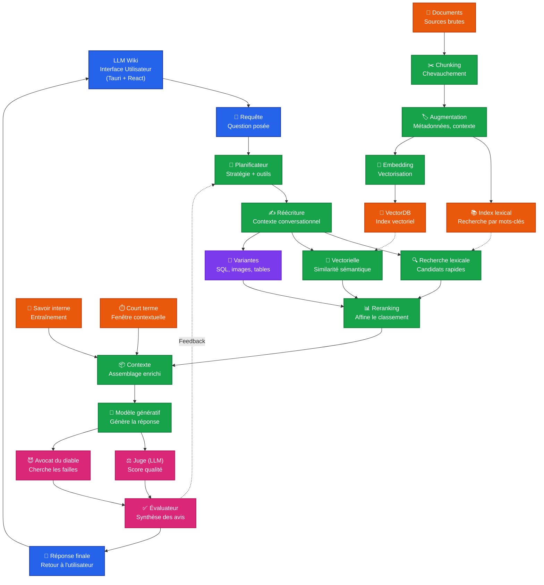
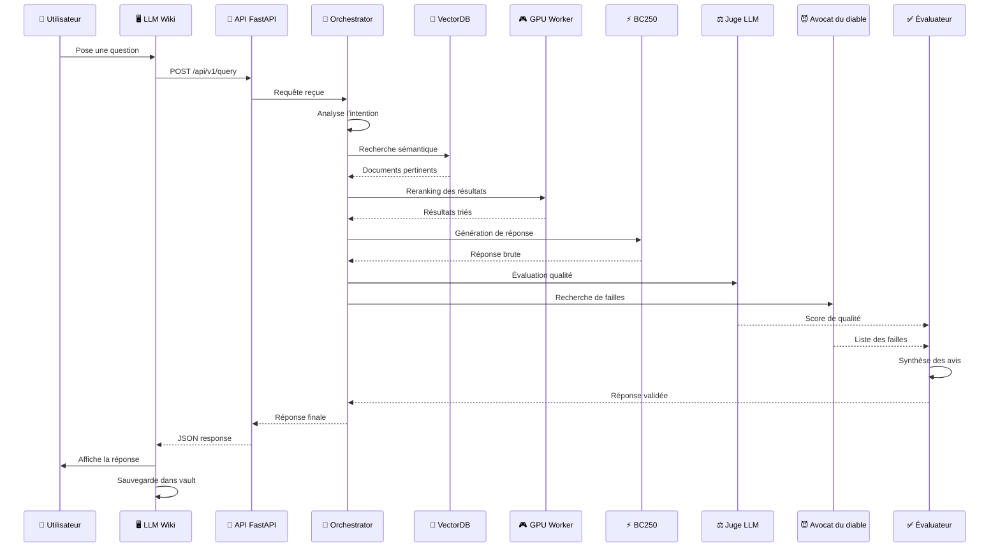

# 🧠 Cluster RAG Multi-Agents 100% Offline (Proxmox + AMD BC250 + LLM Wiki)


> ⚠️ **Statut réel (voir [ROADMAP.md](ROADMAP.md))** : ce dépôt est au stade de conception documentaire. Aucun composant listé ci-dessous n'est encore implémenté. Ce README décrit la cible, pas l'existant.
>
> ⚠️ **Correction hardware (29/07/2026)** : le BC-250 tourne sous **Vulkan (Mesa/RADV)**, pas ROCm — AMD ne fournit pas de bibliothèques rocBLAS pour ce GPU (GFX1013). Sa mémoire est **16 GB GDDR6 unifiée** partagée CPU/GPU (pas 12 GB dédiés). Voir [docs communautaires BC-250](https://elektricm.github.io/amd-bc250-docs/) et le [guide AI akandr/bc250](https://github.com/akandr/bc250).

Un système de **Retrieval-Augmented Generation (RAG)** souverain, résilient et entièrement hors ligne. Ce projet vise une architecture de **multi-agents avec évaluation croisée** (Juge LLM & Avocat du diable) pour minimiser les hallucinations, déployée sur un cluster Proxmox 3 nœuds incluant un nœud baremetal AMD BC250, et conçu pour s'intégrer avec [LLM Wiki](https://github.com/nashsu/llm_wiki) comme interface utilisateur.

---

## 📑 Table des matières

- [Vue d'ensemble](#-vue-densemble)
- [Architecture du Système](#️-architecture-du-système)
- [Intégration avec LLM Wiki](#-intégration-avec-llm-wiki)
- [Fonctionnalités Clés](#-fonctionnalités-clés)
- [Infrastructure Matérielle](#️-infrastructure-matérielle)
- [Stack Technique](#️-stack-technique)
- [Guide d'Installation](#-guide-dinstallation)
- [Utilisation](#-utilisation)
- [Roadmap](#️-roadmap)
- [Contribuer](#-contribuer)
- [Licence](#-licence)

---

## 🌍 Vue d'ensemble

Dans un contexte où la confidentialité des données et la souveraineté numérique sont cruciales, ce projet vise une alternative robuste aux API cloud propriétaires.

Contrairement aux RAG classiques qui se contentent de générer une réponse, ce système intègre une **couche d'évaluation multi-agents** inspirée des processus de révision humains. Après la génération, un "Juge" évalue la qualité, tandis qu'un "Avocat du diable" cherche activement les failles logiques ou les hallucinations. Un "Évaluateur" final synthétise ces avis avant de retourner la réponse à l'utilisateur.

**Frontend cible** : ce backend est conçu pour alimenter [LLM Wiki](https://github.com/nashsu/llm_wiki), une application desktop (Tauri + React) qui transforme le cluster en un "second cerveau" local, avec gestion de graphe de connaissances, sync Obsidian et web clipper.

---

## 🏗️ Architecture du Système

Voir le schéma complet dans [`docs/architecture.svg`](docs/architecture.svg) (mapping des composants sur les 3 machines du cluster).

### Diagramme Principal - Architecture RAG Complète avec Mapping Cluster



### Flux de Données Détaillé



---

## 🔗 Intégration avec LLM Wiki

1. **Installer LLM Wiki** :
   ```bash
   git clone https://github.com/nashsu/llm_wiki.git
   cd llm_wiki
   # Suivre les instructions d'installation du repo officiel
   ```

2. **Configurer le backend** dans LLM Wiki pour pointer vers le cluster : remplacer l'URL Ollama locale par l'URL de l'API du cluster (voir `.env.example` — ne jamais coder une IP en dur, utiliser `CLUSTER_API_URL`), ou configurer un reverse proxy Nginx sur le LXC Master pour exposer une API compatible OpenAI.

3. **Format de réponse attendu** (compatible OpenAI) — à implémenter côté FastAPI :
   ```json
   {
     "id": "chatcmpl-123",
     "object": "chat.completion",
     "choices": [{
       "message": {
         "role": "assistant",
         "content": "Réponse validée par l'évaluateur..."
       }
     }]
   }
   ```

4. **Sync Obsidian (optionnel)** : configurer le vault Obsidian pour pointer vers le dossier `data/` de LLM Wiki.

**Ressources** : [repo officiel](https://github.com/nashsu/llm_wiki) · licence GPL v3 · stack Tauri (Rust) + React + TypeScript.

---

## ⭐ Fonctionnalités Clés

- 🔒 **100% Offline & Souverain** : aucune donnée ne quitte le réseau local.
- 🤖 **Évaluation Multi-Agents** : pattern "Juge + Avocat du diable" pour limiter les hallucinations.
- 🔍 **Recherche Hybride** : lexicale (BM25) + vectorielle (sémantique) + variantes (SQL, tables).
- ⚡ **Orchestration Distribuée** : séparation orchestration / inférence GPU / stockage.
- 🛠️ **Hardware Atypique** : exploitation de la puce AMD BC250 (jusqu'à 40 CUs après unlock) via Vulkan/Mesa.
- 🧠 **Frontend LLM Wiki** : graphe de connaissances, sync Obsidian, web clipper.
- 🔄 **Boucle de Feedback** : l'évaluateur peut renvoyer de l'information au planificateur.

---

## 🖥️ Infrastructure Matérielle

| Nœud | Rôle | CPU / RAM | GPU / Accélérateur | Virtualisation |
| :--- | :--- | :--- | :--- | :--- |
| **Machine 1** | **Master** (Orchestration, API, VectorDB, Monitoring) | Xeon 2699 / 32GB ECC | – | Proxmox (LXC) |
| **Machine 2** | **GPU Worker** (Inference, Reranking) | Xeon 2698 / 64GB ECC | NVIDIA Quadro RTX 4000 (8GB) | Proxmox (LXC privilégié) |
| **Machine 3** | **BC250 Baremetal** (Gros modèles, variantes) | AMD BC250 (Zen 2, 6c/12t) | 16 GB GDDR6 **unifiée** CPU+GPU · 24 CU stock / 40 CU après unlock communautaire | Debian Testing/Sid (baremetal) |
| **Client** | LLM Wiki (interface) | Poste de travail | – | Native (Tauri) |

Répartition prévue des LXC sur la Machine 1 : `100` Orchestrator, `101` Vector DB, `102` API Gateway, `103` Monitoring. Sur la Machine 2 : `200` Inference GPU (passthrough), `201` Workers Agents.

---

## 🛠️ Stack Technique

- **Infrastructure** : Proxmox VE 8.x, LXC, Docker, Docker Compose
- **IA & LLM (Machine 2, RTX 4000)** : Ollama, vLLM, CUDA, modèles open-weight (Qwen2.5, Llama 3.1, Mistral)
- **IA & LLM (Machine 3, BC-250)** : Ollama + backend **Vulkan** (`OLLAMA_VULKAN=1`), Mesa/RADV 25.1+ — **pas ROCm** (non supporté sur GFX1013)
- **Orchestration Agents** : CrewAI ou LangGraph (choix à trancher, voir [ROADMAP.md](ROADMAP.md))
- **Vector Store & DB** : ChromaDB, PostgreSQL, Redis
- **API & Backend** : FastAPI, Nginx
- **Frontend** : [LLM Wiki](https://github.com/nashsu/llm_wiki) (Tauri + React + TypeScript)

---

## 🚀 Guide d'Installation

> Les scripts référencés ci-dessous sont des stubs à compléter — voir [ROADMAP.md](ROADMAP.md) pour l'état d'avancement de chacun.

### 1. Prérequis
- Cluster Proxmox VE 8.x configuré
- Machine baremetal Debian 12 avec puce AMD BC250
- Accès root à toutes les machines
- (Optionnel) poste client pour LLM Wiki

### 2. Configuration du Nœud BC250 (baremetal)

*Ce nœud ne peut pas être virtualisé, il doit tourner en natif.*

```bash
cd infrastructure/bc250
./setup-vulkan-stack.sh    # Mesa/Vulkan (pas ROCm — voir avertissement en tête de README)
./enable-40cu-unlock.sh    # optionnel : débloque les 16 CU masqués en usine (24 → 40)
```

Puis configurer Ollama pour le backend Vulkan (variables clés, voir `.env.example`) :

```bash
sudo mkdir -p /etc/systemd/system/ollama.service.d
cat <<EOF | sudo tee /etc/systemd/system/ollama.service.d/override.conf
[Service]
Environment=OLLAMA_VULKAN=1
Environment=OLLAMA_FLASH_ATTENTION=1
Environment=OLLAMA_KV_CACHE_TYPE=q4_0
Environment=OLLAMA_CONTEXT_LENGTH=65536
Environment=OLLAMA_MAX_LOADED_MODELS=1
OOMScoreAdjust=-1000
EOF
sudo systemctl daemon-reload && sudo systemctl restart ollama
```

### 3. Déploiement des LXC Proxmox

```bash
cd infrastructure/proxmox
sudo ./create-lxc-master.sh   # LXC 100, 101, 102, 103
sudo ./create-lxc-gpu.sh      # LXC 200 (passthrough GPU), 201
```

### 4. Lancement de la stack Docker

Sur le LXC Master (Orchestrator) :

```bash
cd infrastructure/docker
docker compose -f docker-compose.orchestrator.yml up -d
```

### 5. Installation de LLM Wiki (client)

```bash
git clone https://github.com/nashsu/llm_wiki.git
cd llm_wiki
# Suivre les instructions d'installation du repo officiel
# Configurer l'URL du backend pour pointer vers le cluster
```

### 6. Téléchargement des modèles

```bash
ollama pull qwen2.5:7b
ollama pull qwen2.5:14b
ollama pull llama3.1:8b
ollama pull mistral:7b
```

---

## 💻 Utilisation

### Via API (cURL)

```bash
curl -X POST "${CLUSTER_API_URL}/api/v1/query" \
  -H "Content-Type: application/json" \
  -d '{
    "question": "Quelle est la stratégie de déploiement recommandée pour le BC250 ?",
    "context": "infrastructure"
  }'
```

`CLUSTER_API_URL` est défini dans `.env` (voir `.env.example`) — ne jamais coder l'IP du cluster en dur dans les exemples ou les scripts commités.

### Via LLM Wiki

1. Lancer LLM Wiki sur le poste client
2. Configurer l'URL du backend via `CLUSTER_API_URL`
3. Poser la question dans l'interface
4. La réponse validée par le multi-agent s'affiche
5. Possibilité de review et d'ajout au vault Obsidian

---

## 🗺️ Roadmap

Voir [ROADMAP.md](ROADMAP.md) pour le détail et l'état réel d'avancement (rien n'est encore fait — ce projet part de zéro sur le code, seule la conception documentaire existe).

---

## 🤝 Contribuer

1. Fork le projet
2. Créer une branche (`git checkout -b feature/AmazingFeature`)
3. Committer (`git commit -m 'Add some AmazingFeature'`)
4. Push (`git push origin feature/AmazingFeature`)
5. Ouvrir une Pull Request

---

## 📄 Licence

Ce projet est distribué sous licence MIT — voir [LICENSE](LICENSE).

**Note** : LLM Wiki est distribué sous licence GPL v3, voir https://github.com/nashsu/llm_wiki pour les détails.

---

## 🙏 Remerciements

- [nashsu](https://github.com/nashsu) pour [LLM Wiki](https://github.com/nashsu/llm_wiki), qui inspire l'interface
- La communauté Proxmox et la communauté BC-250 ([elektricM/amd-bc250-docs](https://github.com/elektricM/amd-bc250-docs), [akandr/bc250](https://github.com/akandr/bc250), [duggasco/bc250-40cu-unlock](https://github.com/duggasco/bc250-40cu-unlock)) pour le support hardware atypique
- La communauté open-source IA pour les modèles open-weight

---

*Développé pour l'IA souveraine, le hardware open-source et les seconds cerveaux locaux.*
