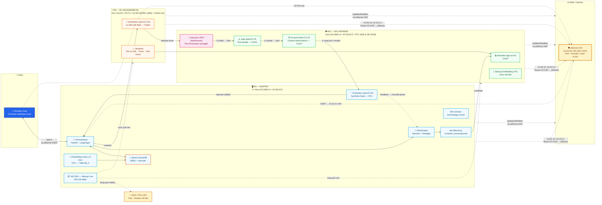
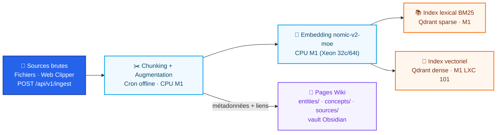
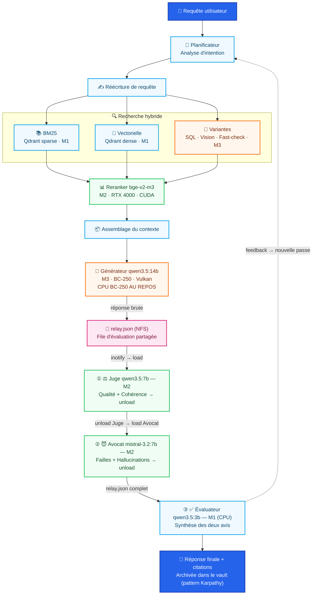
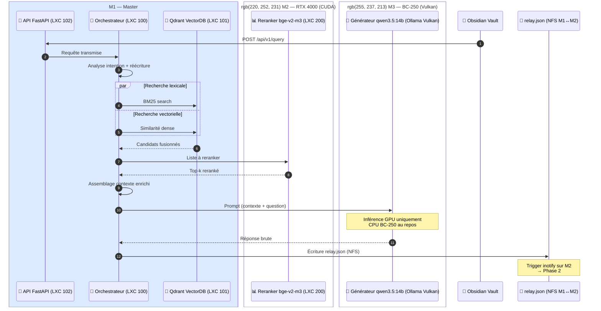
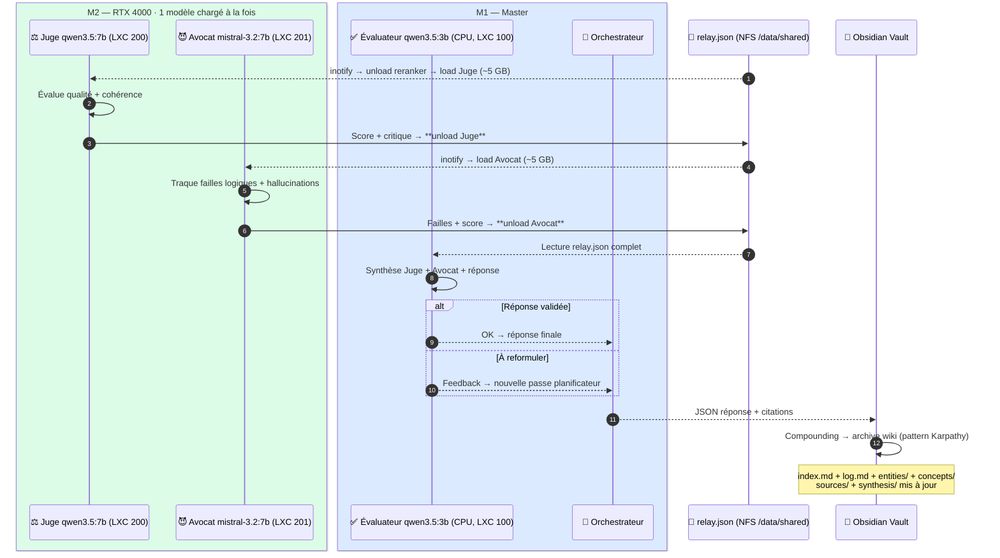
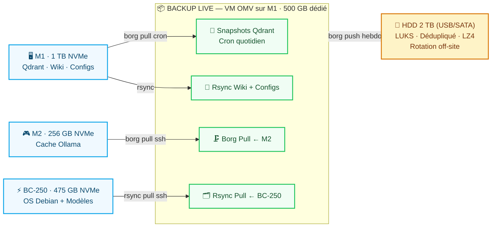
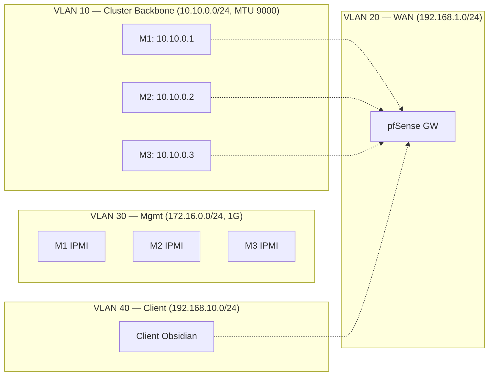
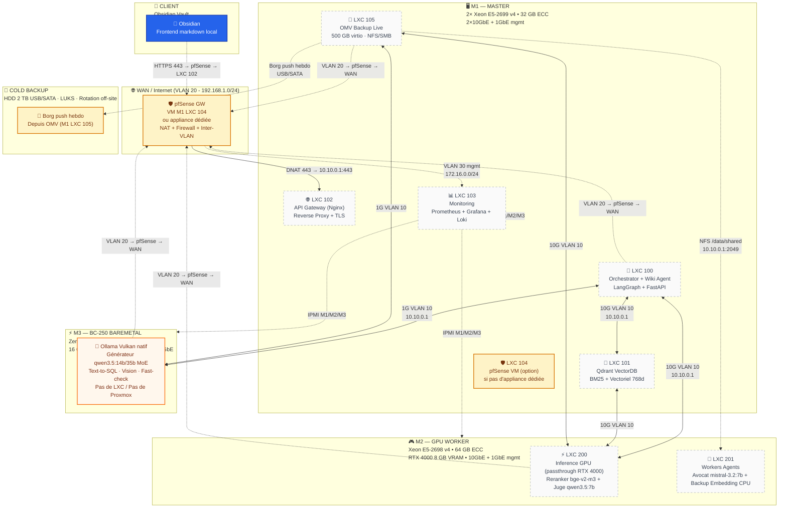
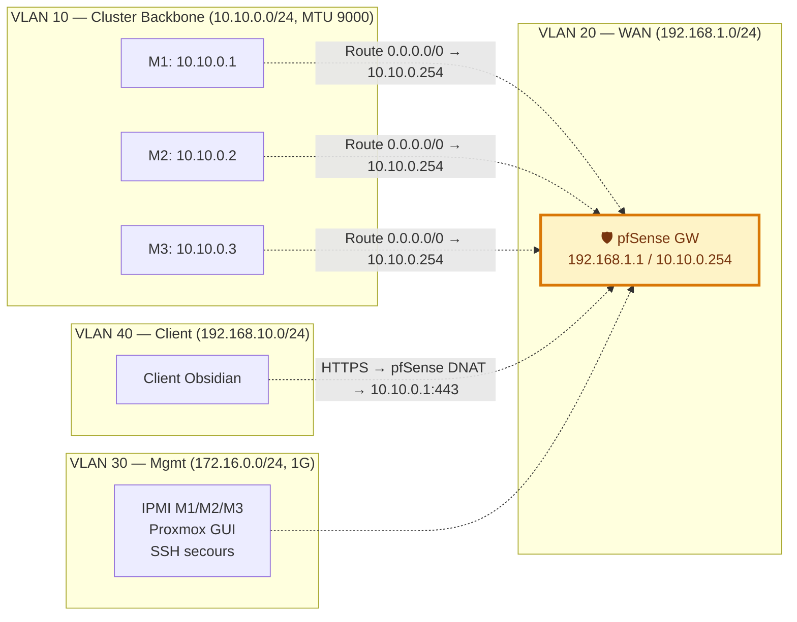

# 🧠 Cluster RAG Multi-Agents 100% Offline (Proxmox + AMD BC250 + Obsidian Vault)


> ⚠️ **Statut réel** (voir [ROADMAP.md](ROADMAP.md)) : ce dépôt est au stade de **conception documentaire**. Aucun composant listé ci-dessous n'est encore implémenté. Ce README décrit la *cible*, pas l'existant.
>
> ⚠️ **Correction hardware (29/07/2026)** : le BC-250 tourne sous **Vulkan (Mesa/RADV)**, pas ROCm — AMD ne fournit pas de bibliothèques rocBLAS pour ce GPU (GFX1013). Sa mémoire est **16 GB GDDR6 unifiée** partagée CPU/GPU (pas 12 GB dédiés). Voir [docs communautaires BC-250](https://elektricm.github.io/amd-bc250-docs/) et le [guide AI akandr/bc250](https://github.com/akandr/bc250).

---

## 📑 Table des matières

- [Vue d'ensemble](#-vue-densemble)
- [Architecture du Système](#️-architecture-du-système)
- [Plan de Backup (3-2-1)](#-plan-de-backup-3-2-1)
- [Topologie Réseau & Sécurité](#-topologie-réseau--sécurité)
- [Intégration avec Obsidian (pattern Karpathy)](#-intégration-avec-obsidian-pattern-karpathy)
- [Fonctionnalités Clés](#-fonctionnalités-clés)
- [Infrastructure Matérielle](#️-infrastructure-matérielle)
- [Stack Technique](#️-stack-technique)
- [Guide d'Installation](#-guide-dinstallation)
- [Utilisation](#-utilisation)
- [Roadmap](#️-roadmap)
- [Contribuer](#-contribuer)
- [Licence](#-licence)

---

## 🌍 Vue d'ensemble

Dans un contexte où la confidentialité des données et la souveraineté numérique sont cruciales, ce projet vise une alternative robuste aux API cloud propriétaires.

Contrairement aux RAG classiques qui se contentent de générer une réponse, ce système intègre une **couche d'évaluation multi-agents** inspirée des processus de révision humains. Après la génération, un **"Juge"** évalue la qualité, tandis qu'un **"Avocat du diable"** cherche activement les failles logiques ou les hallucinations. Un **"Évaluateur"** final synthétise ces avis avant de retourner la réponse à l'utilisateur.

**Frontend cible** : un vault **Obsidian** maintenu par le cluster — l'orchestrateur écrit et met à jour des pages markdown interreliées (`index.md`, `log.md`, entités, concepts, synthèses) directement dans un dossier vault. L'utilisateur consulte le graphe de connaissances, les pages, et les liens via l'interface Obsidian. Aucune app Tauri/React à maintenir.

---

## 🏗️ Architecture du Système

Voir aussi le schéma complet dans [`docs/architecture.svg`](docs/architecture.svg) (mapping des composants sur les 3 machines du cluster).

### Légende des couleurs (commune à tous les diagrammes)

| Couleur | Rôle | Machine |
|---------|------|---------|
| 🔵 `#2563eb` | Frontend / Entrées-Sorties | Client (Obsidian) |
| 🩵 `#0ea5e9` | **M1 Master** : Orchestration, API, VectorDB, Embedding CPU, Évaluateur, NFS Relay | Machine 1 |
| 🟢 `#22c55e` | **M2 GPU Worker** : Reranker, Juge, Avocat, Backup Embedding CPU | Machine 2 |
| 🟠 `#f97316` | **M3 BC250 Baremetal** : Générateur, Text-to-SQL, Vision, Fast-check | Machine 3 |
| 🟡 `#d97706` | Backup Cold (HDD LUKS) | Off-site |
| 🩷 `#db2777` | `relay.json` (NFS partagé M1↔M2) | Évaluation séquentielle |

---

### 🗺️ Vue d'ensemble du cluster



---

### 📥 Flux d'ingestion (offline, asynchrone)



---

### 🔄 Flux de requête & évaluation multi-agents (séquentiel Juge → Avocat)



---

### 🔀 Flux de données détaillé

#### Phase 1 — Recherche & Génération



#### Phase 2 — Évaluation multi-agents & Archivage



---

## 🔐 Plan de Backup (3-2-1)

### Architecture



### Règle 3-2-1

| Règle | Implémentation |
|-------|----------------|
| **3 copies** | Prod + OMV Live + HDD Cold |
| **2 médias** | NVMe + HDD mécanique |
| **1 off-site** | Rotation physique HDD 2 TB |

### Outils & Rétention

| Outil | Usage |
|-------|-------|
| **borg** | Sauvegarde dédupliquée, chiffrée, compression LZ4 |
| **rsync** | Sync configs Ollama, wiki, scripts |
| **qdrant snapshot** | Backup atomique VectorDB (cron quotidien) |
| **LUKS** | Chiffrement HDD (clés hors cluster) |
| **OMV** | Interface NFS/SMB, scheduling cron |


---

## 🌐 Topologie Réseau & Sécurité

### Topologie physique

| Machine | Interfaces |
|---------|------------|
| **M1 (Master)** | 2× 10 GbE (backbone) + 1× 1 GbE (mgmt/secours) |
| **M2 (GPU Worker)** | 1× 10 GbE (backbone) + 1× 1 GbE (mgmt) |
| **M3 (BC250)** | 1× 1 GbE (backbone via switch 10G) |
| **Client** | 1× 1 GbE (LAN) |

### VLAN / Sous-réseaux



| VLAN | CIDR | Usage | Machines |
|------|------|-------|----------|
| 10 (Cluster) | `10.10.0.0/24` | Backbone 10G inter-nœuds (Qdrant, Ollama API, NFS) | M1, M2, M3 |
| 20 (WAN) | `192.168.1.0/24` | pfSense → Internet (updates, modèles) | pfSense GW |
| 30 (Mgmt) | `172.16.0.0/24` | Proxmox GUI, IPMI, SSH secours (1G) | M1, M2, M3 |
| 40 (Client) | `192.168.10.0/24` | Obsidian client, Web UI | Client, pfSense |

**Passerelle** : pfSense (VM sur Proxmox M1 LXC 104 ou appliance dédiée) — routes inter-VLAN + NAT sortant.

### NFS Relay (évaluation)

- **Export M1** : `/data/shared` → `10.10.0.0/24(rw,sync,no_subtree_check,no_root_squash)`
- **Mount M2** : `/data/shared` sur `10.10.0.1:/data/shared` (fstab, `_netdev`)
- **Fichier** : `evaluation-relay.json` (verrou fichier atomique, TTL 300s)

### Règles Firewall (pfSense) — Flux autorisés

| Source | Dest | Proto/Port | Usage |
|--------|------|------------|-------|
| `10.10.0.0/24` | `10.10.0.0/24` | TCP 6333 | Qdrant (VectorDB) |
| `10.10.0.0/24` | `10.10.0.0/24` | TCP 11434 | Ollama API (M2, M3) |
| `10.10.0.0/24` | `10.10.0.0/24` | TCP 2049/NFS | Relay évaluation + vault wiki |
| `10.10.0.2` | `10.10.0.1` | TCP 2049 | Mount NFS M1→M2 |
| `192.168.10.0/24` | `10.10.0.1` | TCP 80/443 | Client → API Gateway (nginx LXC 102) |
| `10.10.0.0/24` | `192.168.1.0/24` | TCP 80/443 | Sortie modèles/updates (via pfSense NAT) |
| `172.16.0.0/24` | *any* | SSH/HTTPS | Admin Proxmox/IPMI (isolé) |

**MTU** : 9000 (Jumbo frames) sur VLAN 10 pour NFS/Ollama/Qdrant — gain ~15% débit gros transferts.

---

## 🔗 Intégration avec Obsidian (pattern Karpathy)

Le frontend est un **vault Obsidian standard** — le cluster écrit et met à jour des pages markdown structurées. L'utilisateur ouvre Obsidian, pointe vers le dossier vault, et navigue via le graphe de connaissances.

### Structure du Vault (`/data/wiki`)

```
wiki/
├── index.md              # Catalogue des pages
├── log.md                # Chronologie des interactions
├── entities/             # Personnes, lieux, organisations
├── concepts/             # Idées, thèmes, définitions
├── sources/              # Références originales (ingest)
└── synthesis/            # Analyses, comparatifs, rapports
```

### Convention Frontmatter YAML (extrait `AGENTS.md`)

```yaml
---
title: "Nom de la page"
type: "entity|concept|source|synthesis|log"
tags: ["tag1", "tag2"]
sources: ["source1.md", "url"]
created: "2026-07-29T10:30:00Z"
updated: "2026-07-29T10:30:00Z"
version: 1
---
```

### Endpoints API

| Endpoint | Description |
|----------|-------------|
| `POST /api/v1/ingest` | Envoie une source (fichier, URL, texte) → crée/MAJ pages wiki |
| `POST /api/v1/query` | Pose une question → réponse synthétisée + citations |
| `GET /api/v1/lint` | Health check wiki : pages orphelines, contradictions, gaps |

### Workflow Web Clipper

1. **Obsidian Web Clipper** (extension navigateur) convertit articles web en markdown
2. Injection via `curl -X POST ${CLUSTER_API_URL}/api/v1/ingest -F "file=@article.md"`
3. Le cluster : chunk → embed → index → écrit pages wiki → MAJ `index.md` + `log.md`

**Ressources** : [Obsidian](https://obsidian.md) · [pattern Karpathy LLM Wiki](https://github.com/karpathy/LLMWiki) (inspiration).

---

## ⭐ Fonctionnalités Clés

- 🔒 **100% Offline & Souverain** : aucune donnée ne quitte le réseau local.
- 🤖 **Évaluation Multi-Agents** : pattern "Juge + Avocat du diable" pour limiter les hallucinations.
- 🔍 **Recherche Hybride** : lexicale (BM25) + vectorielle (sémantique) + variantes (SQL, tables, vision).
- ⚡ **Orchestration Distribuée** : séparation orchestration / inférence GPU / stockage.
- 🛠️ **Hardware Atypique** : exploitation de la puce AMD BC250 (jusqu'à 40 CUs après unlock) via Vulkan/Mesa.
- 🧠 **Frontend Obsidian Vault** : graphe de connaissances, web clipper, pages markdown maintenues par le cluster en continu.
- 🔄 **Boucle de Feedback** : l'évaluateur peut renvoyer de l'information au planificateur.

---

## 🖥️ Infrastructure Matérielle

| Nœud | Rôle | CPU / RAM | GPU / Accélérateur | Virtualisation |
| :--- | :--- | :--- | :--- | :--- |
| **Machine 1** | **Master** (Orchestration, API, VectorDB, Monitoring, Evaluator, Embedding CPU, **Relay NFS**) | 2× Xeon E5-2699 v4 / **32 GB ECC** | **AMD Radeon RX 580** (8 GB) | Proxmox VE 9.3 (LXC 100, 101, 102, 103, 105) |
| **Machine 2** | **GPU Worker** (Inference, Reranking, Judge, Avocat, Backup Embedding CPU) | 1× Xeon E5-2698 v4 / **64 GB ECC** | **NVIDIA Quadro RTX 4000** (8 GB VRAM dédiée) | Proxmox VE 9.3 (LXC 200 privilégié GPU, 201) |
| **Machine 3** | **BC250 Baremetal** (Generator, Text-to-SQL, Vision, Granite fast-check) | Carte minage BIOS modifiée · Puce PS5 (BC-250, Zen 2, 6c/12t) · **40 CU débloquées** | **16 GB GDDR6 unifiée** CPU+GPU · 12 GB dispo pour IA (512 MB carve-out dynamique) | **BIOS P3.00+ patché · VRAM dynamique 512 MB** | Debian Testing/Sid (baremetal, Ollama Vulkan natif) |
| **Client** | Obsidian Vault (visualisation + ingestion) | Poste de travail | – | Native (Electron) |

### Stockage

| Machine | Disque | Usage |
|---------|--------|-------|
| **M1 (Master)** | 1 TB NVMe | Proxmox + LXCs + Qdrant + Wiki + **OMV VM** (500 GB dédié backup live) |
| **M2 (GPU Worker)** | 256 GB NVMe | Proxmox + LXCs + Ollama cache BC250 |
| **BC250 (Baremetal)** | 475 GB NVMe | OS Debian + Modèles |
| **Backup Cold** | 2 TB HDD mécanique (USB/SATA, LUKS) | Archive dédupliquée, rétention 30j/12m/3y |

### Règle d'or BC250 ⚡

> **Le CPU du BC250 est le serviteur du GPU.** Toute charge CPU significative sur BC250 est un vol de bande passante mémoire au Generator 14B. Le CPU BC250 (Zen 2 6c/12t) doit rester au repos (ou charge minimale) quand le GPU fait de l'inférence Vulkan. Embedding = Machine 1 CPU (principal) / Machine 2 CPU (backup).

**Preuve** : Le BC250 a 16 GB GDDR6 **unifiée** (CPU+GPU même pool, même bande passante). Si le CPU est chargé (embedding, batch, compilation) :
1. **Contention bande passante mémoire** → le GPU 14B est affamé
2. **Pression thermique** → CPU + GPU = jusqu'à 235W TDP dans format compact → throttling certain
3. **VRAM effective réduite** → le modèle 14B perd des ressources critiques

**Références** :
- [AMD BC250 Documentation](https://elektricm.github.io/amd-bc250-docs/) — Unified Memory Architecture, Vulkan-only, 40 CU unlock
- [akandr/bc250](https://github.com/akandr/bc250) — Ollama + Vulkan benchmarks, GFX1013 specifics, roofline analysis

---

### Répartition LXC prévue

| Machine | LXC | Rôle |
|---------|-----|------|
| **Machine 1** | `100` | Orchestrator + Wiki Agent |
| | `101` | Vector DB (Qdrant) |
| | `102` | API Gateway (Nginx) |
| | `103` | Monitoring (Prometheus/Grafana/Loki) |
| | `105` | OMV Backup (500 GB disque virtio dédié) |
| **Machine 2** | `200` | Inference GPU (passthrough RTX 4000) — Reranker + Judge |
| | `201` | Workers Agents — Avocat + Backup Embedding CPU |
| **Machine 3** | — | Ollama Vulkan natif (pas de LXC) |

---

### 🖥️ Topologie physique : 3 machines + LXC/VM + pfSense



---

### 🌐 Topologie réseau avec pfSense (Gateway WAN + Firewall Inter-VLAN)



---

## 🛠️ Stack Technique

- **Infrastructure** : Proxmox VE 9.3, LXC, Docker, Docker Compose
- **IA & LLM (Machine 2, RTX 4000)** : Ollama, vLLM, CUDA, modèles open-weight (Qwen3.5, Mistral, BGE)
- **IA & LLM (Machine 3, BC-250)** : Ollama + backend **Vulkan** (`OLLAMA_VULKAN=1`), Mesa/RADV 25.1+ — **pas ROCm** (non supporté sur GFX1013)
- **IA & LLM (Machine 1, RX 580)** : Ollama + ROCm/OpenCL pour embedding léger ou modèles de secours
- **Orchestration Agents** : **LangGraph** (choix tranché — graphe d'état explicite, parallélisme natif, checkpointing)
- **Vector Store & DB** : **Qdrant** (hybrid search natif), PostgreSQL, Redis
- **API & Backend** : FastAPI, Nginx (reverse proxy LXC 102)
- **Frontend** : **Obsidian Vault** (pattern Karpathy) — pages markdown maintenues par le cluster, visualisation via Obsidian (Electron)
- **Observabilité** : Prometheus, Grafana, Loki

---

## 🚀 Guide d'Installation

> Les scripts référencés ci-dessous sont des **stubs à compléter** — voir [ROADMAP.md](ROADMAP.md) pour l'état d'avancement de chacun.

### 1. Prérequis

- Cluster Proxmox VE 9.3 configuré
- Machine baremetal Debian Testing/Sid avec puce AMD BC250
- Accès root à toutes les machines
- (Optionnel) poste client pour LLM Wiki

### 2. Configuration du Nœud BC250 (baremetal)

*Ce nœud ne peut pas être virtualisé, il doit tourner en natif.*

> ✅ **BIOS déjà flashé** : **P3.00+ community-patched**, **VRAM dynamique 512 MB** configurée (carve-out UMA).
> Voir [BIOS Flashing Guide](https://elektricm.github.io/amd-bc250-docs/bios/flashing/) si besoin de refaire.
> Paramètre boot install : `nomodeset` (à retirer post-install Mesa).

```bash
cd infrastructure/bc250
./setup-vulkan-stack.sh    # Mesa/Vulkan (pas ROCm — voir avertissement en tête de README)
./enable-40cu-unlock.sh    # optionnel : débloque les 16 CU masqués en usine (24 → 40)
```

Puis configurer Ollama pour le backend Vulkan (variables clés, voir `.env.example`) :

```bash
sudo mkdir -p /etc/systemd/system/ollama.service.d
cat <<EOF | sudo tee /etc/systemd/system/ollama.service.d/override.conf
[Service]
Environment=OLLAMA_VULKAN=1
Environment=OLLAMA_FLASH_ATTENTION=1
Environment=OLLAMA_KV_CACHE_TYPE=q4_0
Environment=OLLAMA_CONTEXT_LENGTH=65536
Environment=OLLAMA_MAX_LOADED_MODELS=1
OOMScoreAdjust=-1000
EOF
sudo systemctl daemon-reload && sudo systemctl restart ollama
```

> ⚠️ **Piège documenté** : vérifier après reboot que `ttm.pages_limit` tient à `4194304` (`systemd-tmpfiles` peut l'écraser au boot).

### 3. Déploiement des LXC Proxmox

```bash
cd infrastructure/proxmox
sudo ./create-lxc-master.sh   # LXC 100, 101, 102, 103, 105
sudo ./create-lxc-gpu.sh      # LXC 200 (passthrough GPU), 201
```

### 4. Lancement de la stack Docker

Sur le LXC Master (Orchestrator) :

```bash
cd infrastructure/docker
docker compose -f docker-compose.orchestrator.yml up -d
docker compose -f docker-compose.vector-db.yml up -d
```

### 5. Configuration du vault Obsidian (client)

```bash
mkdir -p ~/rag-wiki-vault
# Monter le vault sur le LXC Master (NFS/SMB) pour que le cluster y écrive
# Ouvrir Obsidian → "Open folder as vault" → sélectionner ~/rag-wiki-vault
```

### 6. Téléchargement des modèles (versions validées backlog 29/07/2026)

```bash
# Sur Machine 2 (RTX 4000) — LXC 200/201
ollama pull qwen3.5:7b@sha256:...      # Judge
ollama pull mistral-small-3.2:7b@sha256:...  # Avocat
ollama pull bge-reranker-v2-m3@sha256:...    # Reranker
# Backup embedding CPU sur M2 (64 GB RAM inutilisée)
ollama pull nomic-embed-text-v2-moe@sha256:...

# Sur Machine 3 (BC250) — Ollama Vulkan natif
ollama pull qwen3.5:14b@sha256:...           # Generator principal (Q4_K_M ~9 GB)
ollama pull qwen3.5-35b-a3b@sha256:...       # Generator alternatif MoE (IQ2_M ~11 GB)
ollama pull qwen3-coder-30b-a3b@sha256:...   # Text-to-SQL / Code (IQ2_M)
ollama pull nomic-embed-text-v2-moe@sha256:...  # Embedding MoE (pour variantes)
ollama pull llava-next:13b@sha256:...        # Vision (Phase 5.2)
ollama pull qwen2.5-vl@sha256:...            # Vision alt (Phase 5.2)
ollama pull granite-4.0-h-tiny@sha256:...    # Fast-check lexical (Phase 5.4)

# Sur Machine 1 (RX 580 - secours/embedding léger)
ollama pull nomic-embed-text@sha256:...      # Embedding secours
ollama pull qwen2.5:3b@sha256:...            # Monitoring/fallback
```

> 🔒 **Reproductibilité** : fixer les digests SHA256 dans `.env` / `docker-compose` — `ollama pull model@sha256:...` évite les surprises de tags mobiles.

---

## 💻 Utilisation

### Via API (cURL)

```bash
curl -X POST "${CLUSTER_API_URL}/api/v1/query" \
  -H "Content-Type: application/json" \
  -d '{
    "question": "Quelle est la stratégie de déploiement recommandée pour le BC250 ?",
    "context": "infrastructure"
  }'
```

`CLUSTER_API_URL` est défini dans `.env` (voir `.env.example`) — **ne jamais coder l'IP du cluster en dur** dans les exemples ou les scripts commités.

### Via Obsidian

1. Ouvrir le vault Obsidian sur le poste client (vault partagé avec le cluster)
2. Naviguer dans les pages wiki (`index.md`, `entities/`, `concepts/`, `sources/`)
3. Utiliser le **graphe de connaissances** (Obsidian Graph View) pour explorer les liens
4. Les pages sont mises à jour automatiquement par le cluster via les endpoints API
5. Pour ajouter une source : `curl -X POST ${CLUSTER_API_URL}/api/v1/ingest -F "file=@article.md"`
6. Pour poser une question : `curl -X POST ${CLUSTER_API_URL}/api/v1/query -d '{"question":"..."}'`

---

## 🗺️ Roadmap

Voir [ROADMAP.md](ROADMAP.md) pour le détail et l'état réel d'avancement (rien n'est encore fait — ce projet part de zéro sur le code, seule la conception documentaire existe).

---

## ⚠️ Points de Vigilance DevOps (Risques Maîtrisés)

| Risque | Impact | Mitigation |
|--------|--------|------------|
| **SPOF : Machine 1 (Master)** | Qdrant + API + Wiki + Evaluator + NFS = tout s'arrête si M1 tombe | → Backup Qdrant snapshot quotidien sur M2. NFS export read-only possible depuis M2. |
| **Latence NFS sur évaluation** | Relay file = point de synchronisation bloquant | → MTU 9000 + 10GbE = <1ms RTT. Timeout 120s Juge → Avocat. Acceptable. |
| **BC250 baremetal = pas de snapshot/rollback** | Mise à jour noyau/BIOS risquée | → Tests sur VM simulée d'abord. Backup config `/etc` + BIOS P3.00 sur USB. |
| **RTX 4000 8GB limite dure** | Pas de place pour modèle > 7B quantifié | → Choix validé : Judge/Avocat 7B max. Si besoin 14B → seul BC250 peut. |
| **Modèles non verrouillés (tags Ollama)** | `qwen3.5:7b` pull = version mobile → reproductibilité | → Fixer digests SHA256 dans `.env` / `docker-compose`. `ollama pull qwen3.5:7b@sha256:...` |
| **Concurrency lock vault Obsidian** | Client + Cluster écrivent simultanément | → NFS `no_root_squash` + file locking (fcntl). Ou versioning git sidecar. |

### Recommandations immédiates

1. **Lock les versions modèles** — Ajouter dans `.env` : `OLLAMA_MODEL_JUDGE=qwen3.5:7b@sha256:xxx` etc.
2. **Health checks obligatoires** — `/health` sur chaque service (Ollama, Qdrant, API) → Prometheus scrape.
3. **Secrets management** — Pas de tokens/API keys en dur. `sops` + `.env.encrypted` ou Vault (Phase 7).
4. **Backup Qdrant** — `qdrant snapshot create` cron quotidien → stocké sur M2 (64GB dispo).
5. **Test de charge pré-prod** — `hey` / `locust` sur `/api/v1/query` avec 10-50 RPS avant mise en prod.
6. **Runbook incident** — Documenter : "BC250 ne boot plus", "RTX 4000 OOM", "NFS stale handle", "Qdrant corruption".

---

## 🤝 Contribuer

1. Fork le projet
2. Créer une branche (`git checkout -b feature/AmazingFeature`)
3. Committer (`git commit -m 'Add some AmazingFeature'`)
4. Push (`git push origin feature/AmazingFeature`)
5. Ouvrir une Pull Request

---

## 📄 Licence

Ce projet est distribué sous licence MIT — voir [LICENSE](LICENSE).

---

## 🙏 Remerciements

- [karpathy](https://github.com/karpathy) pour le pattern [LLM Wiki](https://github.com/karpathy/LLMWiki), qui inspire l'architecture frontend
- La communauté Proxmox et la communauté BC-250 ([elektricM/amd-bc250-docs](https://github.com/elektricM/amd-bc250-docs), [akandr/bc250](https://github.com/akandr/bc250), [duggasco/bc250-40cu-unlock](https://github.com/duggasco/bc250-40cu-unlock)) pour le support hardware atypique
- La communauté open-source IA pour les modèles open-weight

---

*Développé pour l'IA souveraine, le hardware open-source et les seconds cerveaux locaux (Obsidian + LLM).*