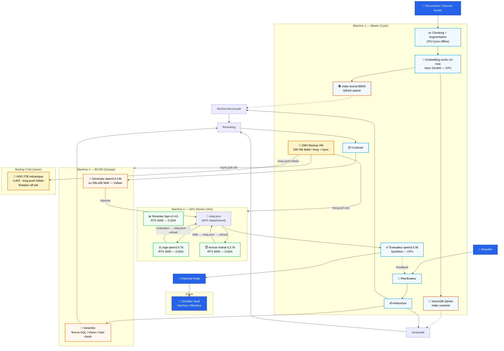
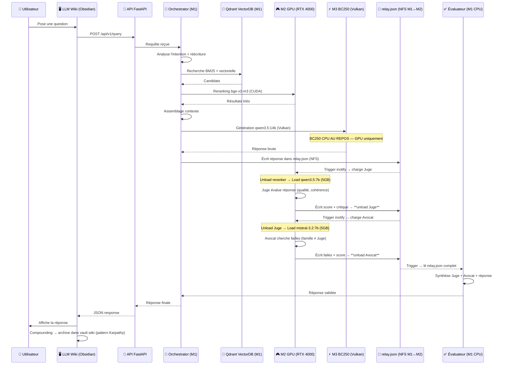

# 🧠 Cluster RAG Multi-Agents 100% Offline (Proxmox + AMD BC250 + Obsidian Vault)


> ⚠️ **Statut réel (voir [ROADMAP.md](ROADMAP.md))** : ce dépôt est au stade de conception documentaire. Aucun composant listé ci-dessous n'est encore implémenté. Ce README décrit la cible, pas l'existant.
>
> ⚠️ **Correction hardware (29/07/2026)** : le BC-250 tourne sous **Vulkan (Mesa/RADV)**, pas ROCm — AMD ne fournit pas de bibliothèques rocBLAS pour ce GPU (GFX1013). Sa mémoire est **16 GB GDDR6 unifiée** partagée CPU/GPU (pas 12 GB dédiés). Voir [docs communautaires BC-250](https://elektricm.github.io/amd-bc250-docs/) et le [guide AI akandr/bc250](https://github.com/akandr/bc250).

Un système de **Retrieval-Augmented Generation (RAG)** souverain, résilient et entièrement hors ligne. Ce projet vise une architecture de **multi-agents avec évaluation croisée** (Juge LLM & Avocat du diable) pour minimiser les hallucinations, déployée sur un cluster Proxmox 3 nœuds incluant un nœud baremetal AMD BC250. Le frontend est un vault **Obsidian** maintenu par un agent LLM dédié (pattern Karpathy) — le cluster écrit et met à jour en continu un wiki de pages markdown interreliées, consultable via le graphe de connaissances Obsidian.

---

## 📑 Table des matières

- [Vue d'ensemble](#-vue-densemble)
- [Architecture du Système](#️-architecture-du-système)
- [Intégration avec Obsidian (pattern Karpathy)](#-intégration-avec-obsidian-pattern-karpathy)
- [Fonctionnalités Clés](#-fonctionnalités-clés)
- [Infrastructure Matérielle](#️-infrastructure-matérielle)
- [Stack Technique](#️-stack-technique)
- [Guide d'Installation](#-guide-dinstallation)
- [Utilisation](#-utilisation)
- [Roadmap](#️-roadmap)
- [Contribuer](#-contribuer)
- [Licence](#-licence)

---

## 🌍 Vue d'ensemble

Dans un contexte où la confidentialité des données et la souveraineté numérique sont cruciales, ce projet vise une alternative robuste aux API cloud propriétaires.

Contrairement aux RAG classiques qui se contentent de générer une réponse, ce système intègre une **couche d'évaluation multi-agents** inspirée des processus de révision humains. Après la génération, un "Juge" évalue la qualité, tandis qu'un "Avocat du diable" cherche activement les failles logiques ou les hallucinations. Un "Évaluateur" final synthétise ces avis avant de retourner la réponse à l'utilisateur.

**Frontend cible** : un vault **Obsidian** maintenu par le cluster — l'orchestrateur écrit et met à jour des pages markdown interreliées (`index.md`, `log.md`, entités, concepts, synthèses) directement dans un dossier vault. L'utilisateur consulte le graphe de connaissances, les pages, et les liens via l'interface Obsidian. Aucune app Tauri/React à maintenir.

---

## 🏗️ Architecture du Système

Voir le schéma complet dans [`docs/architecture.svg`](docs/architecture.svg) (mapping des composants sur les 3 machines du cluster).

### Diagramme Principal - Architecture RAG Complète avec Mapping Cluster



### Flux de Données Détaillé



---

## 🔗 Intégration avec Obsidian (pattern Karpathy)

Le frontend est un vault **Obsidian** standard — le cluster écrit et met à jour des pages markdown structurées. L'utilisateur ouvre Obsidian, pointe vers le dossier vault, et navigue via le graphe de connaissances.

1. **Créer un vault Obsidian** (ou utiliser un existant) sur le poste client :
   ```bash
   mkdir -p ~/rag-wiki-vault
   ```

2. **Monter le vault** sur le LXC Master pour que le cluster y écrive :
   ```bash
   # Sur le LXC 100 (Orchestrator), mount NFS/SMB vers le vault client
   # Ou bind mount local /data/wiki si le vault est sur le même réseau
   ```

3. **Configurer le schéma** : le fichier `AGENTS.md` à la racine du projet définit :
   - Structure du vault : `entities/`, `concepts/`, `sources/`, `synthesis/`, `logs/`
   - Conventions de nommage et frontmatter YAML (tags, sources, dates)
   - Workflows d'ingestion, requête et lint

4. **Endpoints API** mis à disposition par le cluster :
   - `POST /api/v1/ingest` — envoie une source (fichier, URL, texte) → le cluster crée/MAJ les pages wiki
   - `POST /api/v1/query` — pose une question → réponse synthétisée depuis le wiki + citations
   - `GET /api/v1/lint` — health check du wiki : pages orphelines, contradictions, gaps

5. **Obsidian Web Clipper** (extension navigateur) : convertit des articles web en markdown → injectable via `/api/v1/ingest`.

**Ressources** : [Obsidian](https://obsidian.md) · [pattern Karpathy LLM Wiki](https://github.com/karpathy/LLMWiki) (inspiration).

---

## ⭐ Fonctionnalités Clés

- 🔒 **100% Offline & Souverain** : aucune donnée ne quitte le réseau local.
- 🤖 **Évaluation Multi-Agents** : pattern "Juge + Avocat du diable" pour limiter les hallucinations.
- 🔍 **Recherche Hybride** : lexicale (BM25) + vectorielle (sémantique) + variantes (SQL, tables).
- ⚡ **Orchestration Distribuée** : séparation orchestration / inférence GPU / stockage.
- 🛠️ **Hardware Atypique** : exploitation de la puce AMD BC250 (jusqu'à 40 CUs après unlock) via Vulkan/Mesa.
- 🧠 **Frontend Obsidian Vault** : graphe de connaissances, web clipper, pages markdown maintenues par le cluster en continu.
- 🔄 **Boucle de Feedback** : l'évaluateur peut renvoyer de l'information au planificateur.

---

## 🖥️ Infrastructure Matérielle

| Nœud | Rôle | CPU / RAM | GPU / Accélérateur | Virtualisation |
| :--- | :--- | :--- | :--- | :--- |
| **Machine 1** | **Master** (Orchestration, API, VectorDB, Monitoring) | 2× Xeon E5-2699 v4 / 32 GB ECC | **AMD Radeon RX 580** (8 GB) | Proxmox VE 9.3 (LXC) |
| **Machine 2** | **GPU Worker** (Inference, Reranking) | 1× Xeon E5-2698 v4 / 64 GB ECC | **NVIDIA Quadro RTX 4000** (8 GB VRAM) | Proxmox VE 9.3 (LXC privilégié ou VM pour GPU passthrough) |
| **Machine 3** | **BC250 Baremetal** (Gros modèles, variantes, embedding) | Carte minage BIOS modifiée · Puce PS5 (BC-250, Zen 2, 6c/12t) · **40 CU débloquées** | **16 GB GDDR6 unifiée** CPU+GPU · 12 GB dispo pour IA (512 MB carve-out dynamique) | Debian Testing/Sid (baremetal) |
| **Client** | Obsidian Vault (visualisation + ingestion) | Poste de travail | – | Native (Electron) |

**Stockage** :
| Machine | Disque | Usage |
|---------|--------|-------|
| **M1 (Master)** | 1 TB NVMe | Proxmox + LXCs + Qdrant + Wiki + **OMV VM** (500 GB dédié backup live) |
| **M2 (GPU Worker)** | 256 GB NVMe | Proxmox + LXCs + Ollama cache BC250 |
| **BC250 (Baremetal)** | 475 GB NVMe | OS Debian + Modèles |
| **Backup Cold** | 2 TB HDD mécanique (USB/SATA, LUKS) | Archive dédupliquée, rétention 30j/12m/3y |

**Réseau** :
- 2× 10GbE backbone cluster (M1→M2, M1→BC250 via switch)
- 1× 1GbE WAN (pfSense VM sur M1 → Internet)
- 1× 1GbE management/secours
- MTU 9000 jumbo frames sur VLAN 10 cluster

**Règle d'or BC250** : CPU = serviteur du GPU. Aucune charge CPU sur le BC250 pendant l'inférence Vulkan — embedding déporté sur M1/M2 CPU.

**Répartition LXC prévue** :
- Machine 1 : `100` Orchestrator, `101` Vector DB (Qdrant), `102` API Gateway (Nginx), `103` Monitoring (Prometheus/Grafana/Loki), `105` OMV (backup)
- Machine 2 : `200` Inference GPU (passthrough RTX 4000), `201` Workers Agents (Juge, Avocat, backup embedding)
- Machine 3 : Ollama Vulkan natif (pas de LXC)

---

## 🔐 Plan de Backup (3-2-1)

### Architecture

```
PROD (NVMe)                              BACKUP LIVE (NVMe)               COLD (HDD)
┌─────────────────┐    borg pull cron     ┌─────────────────┐   borg push   ┌─────────────┐
│ M1: 1TB         │◄──────────────────────│ OMV VM (M1)     │──────────────►│ HDD 2TB     │
│ Qdrant + Wiki   │                       │ 500 GB dédié    │    hebdo      │ (LUKS,      │
│ + Configs       │                       │ snapshots Qdrant│               │  rotation)  │
├─────────────────┤                       │ rsync Wiki      │               └─────────────┘
│ M2: 256GB       │───borg pull ssh──────►│ backup M2       │
│ Ollama cache    │                       │ backup BC250    │
├─────────────────┤                       │ configs OMV     │
│ BC250: 475GB    │───rsync pull ssh─────►│                 │
│ OS + Models     │                       └─────────────────┘
└─────────────────┘
```

### Règle 3-2-1
- **3 copies** : Prod + OMV Live + HDD Cold
- **2 médias** : NVMe + HDD mécanique
- **1 off-site** : Rotation physique HDD 2TB

### Outils
| Outil | Usage |
|-------|-------|
| **borg** | Sauvegarde dédupliquée, chiffrée, compression LZ4 |
| **rsync** | Sync configs Ollama, wiki, scripts |
| **qdrant snapshot** | Backup atomique VectorDB (cron quotidien) |
| **LUKS** | Chiffrement HDD (clés hors cluster) |
| **OMV (OpenMediaVault)** | Interface NFS/SMB, scheduling cron |

### Rétention
- Quotidien : 7 jours
- Hebdo : 4 semaines
- Mensuel : 12 mois
- Annuel : 3 ans

---


## 🛠️ Stack Technique

- **Infrastructure** : Proxmox VE 9.3, LXC, Docker, Docker Compose
- **IA & LLM (Machine 2, RTX 4000)** : Ollama, vLLM, CUDA, modèles open-weight (Qwen2.5, Llama 3.1, Mistral)
- **IA & LLM (Machine 3, BC-250)** : Ollama + backend **Vulkan** (`OLLAMA_VULKAN=1`), Mesa/RADV 25.1+ — **pas ROCm** (non supporté sur GFX1013)
- **IA & LLM (Machine 1, RX 580)** : Ollama + ROCm/OpenCL pour embedding léger ou modèles de secours
- **Orchestration Agents** : **LangGraph** (choix tranché — graphe d'état explicite, parallélisme natif, checkpointing)
- **Vector Store & DB** : **Qdrant** (hybrid search natif), PostgreSQL, Redis
- **API & Backend** : FastAPI, Nginx (reverse proxy LXC 102)
- **Frontend** : **Obsidian Vault** (pattern Karpathy) — pages markdown maintenues par le cluster, visualisation via Obsidian (Electron)
- **Observabilité** : Prometheus, Grafana, Loki

---

## 🚀 Guide d'Installation

> Les scripts référencés ci-dessous sont des stubs à compléter — voir [ROADMAP.md](ROADMAP.md) pour l'état d'avancement de chacun.

### 1. Prérequis
- Cluster Proxmox VE 9.3 configuré
- Machine baremetal Debian Testing/Sid avec puce AMD BC250
- Accès root à toutes les machines
- (Optionnel) poste client pour LLM Wiki

### 2. Configuration du Nœud BC250 (baremetal)

*Ce nœud ne peut pas être virtualisé, il doit tourner en natif.*

```bash
cd infrastructure/bc250
./setup-vulkan-stack.sh    # Mesa/Vulkan (pas ROCm — voir avertissement en tête de README)
./enable-40cu-unlock.sh    # optionnel : débloque les 16 CU masqués en usine (24 → 40)
```

Puis configurer Ollama pour le backend Vulkan (variables clés, voir `.env.example`) :

```bash
sudo mkdir -p /etc/systemd/system/ollama.service.d
cat <<EOF | sudo tee /etc/systemd/system/ollama.service.d/override.conf
[Service]
Environment=OLLAMA_VULKAN=1
Environment=OLLAMA_FLASH_ATTENTION=1
Environment=OLLAMA_KV_CACHE_TYPE=q4_0
Environment=OLLAMA_CONTEXT_LENGTH=65536
Environment=OLLAMA_MAX_LOADED_MODELS=1
OOMScoreAdjust=-1000
EOF
sudo systemctl daemon-reload && sudo systemctl restart ollama
```

### 3. Déploiement des LXC Proxmox

```bash
cd infrastructure/proxmox
sudo ./create-lxc-master.sh   # LXC 100, 101, 102, 103
sudo ./create-lxc-gpu.sh      # LXC 200 (passthrough GPU), 201
```

### 4. Lancement de la stack Docker

Sur le LXC Master (Orchestrator) :

```bash
cd infrastructure/docker
docker compose -f docker-compose.orchestrator.yml up -d
```

### 5. Configuration du vault Obsidian (client)

```bash
mkdir -p ~/rag-wiki-vault
# Monter le vault sur le LXC Master (NFS/SMB) pour que le cluster y écrive
# Ouvrir Obsidian → "Open folder as vault" → sélectionner ~/rag-wiki-vault
```

### 6. Téléchargement des modèles

```bash
# Sur Machine 2 (RTX 4000)
ollama pull qwen2.5:14b
ollama pull qwen2.5:7b
ollama pull mistral:7b
ollama pull bge-reranker-v2-m3

# Sur Machine 3 (BC250)
ollama pull qwen2.5-coder:14b
ollama pull nomic-embed-text-v2-moe
ollama pull llama3.1:8b

# Sur Machine 1 (RX 580 - secours/embedding léger)
ollama pull nomic-embed-text
ollama pull qwen2.5:3b
```

---

## 💻 Utilisation

### Via API (cURL)

```bash
curl -X POST "${CLUSTER_API_URL}/api/v1/query" \
  -H "Content-Type: application/json" \
  -d '{
    "question": "Quelle est la stratégie de déploiement recommandée pour le BC250 ?",
    "context": "infrastructure"
  }'
```

`CLUSTER_API_URL` est défini dans `.env` (voir `.env.example`) — ne jamais coder l'IP du cluster en dur dans les exemples ou les scripts commités.

### Via Obsidian

1. Ouvrir le vault Obsidian sur le poste client (vault partagé avec le cluster)
2. Naviguer dans les pages wiki (`index.md`, `entities/`, `concepts/`, `sources/`)
3. Utiliser le **graphe de connaissances** (Obsidian Graph View) pour explorer les liens
4. Les pages sont mises à jour automatiquement par le cluster via les endpoints API
5. Pour ajouter une source : `curl -X POST ${CLUSTER_API_URL}/api/v1/ingest -F "file=@article.md"`
6. Pour poser une question : `curl -X POST ${CLUSTER_API_URL}/api/v1/query -d '{"question":"..."}'`

---

## 🗺️ Roadmap

Voir [ROADMAP.md](ROADMAP.md) pour le détail et l'état réel d'avancement (rien n'est encore fait — ce projet part de zéro sur le code, seule la conception documentaire existe).

---

## 🤝 Contribuer

1. Fork le projet
2. Créer une branche (`git checkout -b feature/AmazingFeature`)
3. Committer (`git commit -m 'Add some AmazingFeature'`)
4. Push (`git push origin feature/AmazingFeature`)
5. Ouvrir une Pull Request

---

## 📄 Licence

Ce projet est distribué sous licence MIT — voir [LICENSE](LICENSE).

---

## 🙏 Remerciements

- [karpathy](https://github.com/karpathy) pour le pattern [LLM Wiki](https://github.com/karpathy/LLMWiki), qui inspire l'architecture frontend
- La communauté Proxmox et la communauté BC-250 ([elektricM/amd-bc250-docs](https://github.com/elektricM/amd-bc250-docs), [akandr/bc250](https://github.com/akandr/bc250), [duggasco/bc250-40cu-unlock](https://github.com/duggasco/bc250-40cu-unlock)) pour le support hardware atypique
- La communauté open-source IA pour les modèles open-weight

---

*Développé pour l'IA souveraine, le hardware open-source et les seconds cerveaux locaux (Obsidian + LLM).*