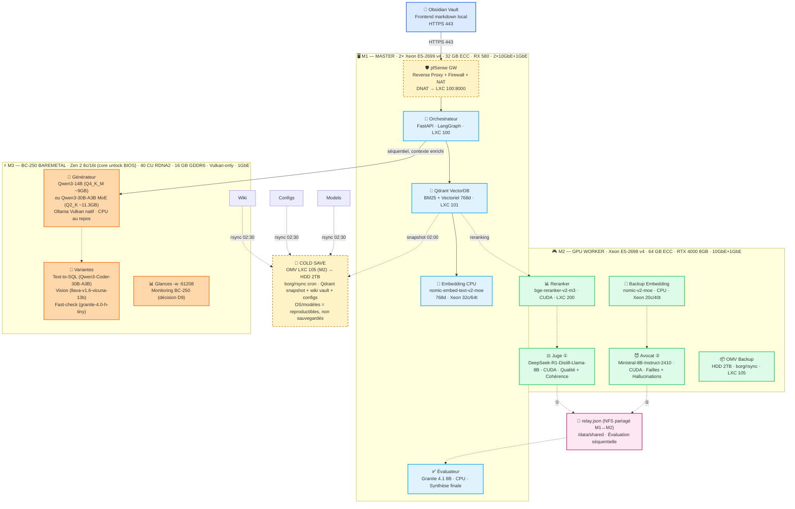
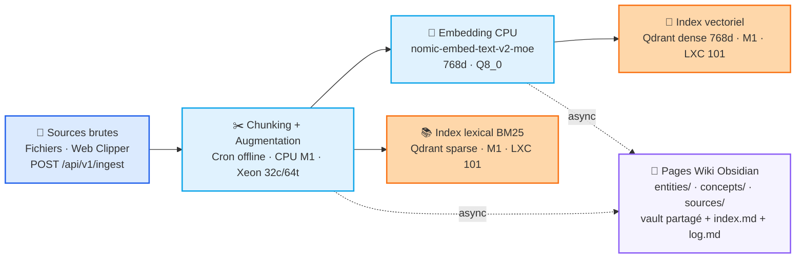
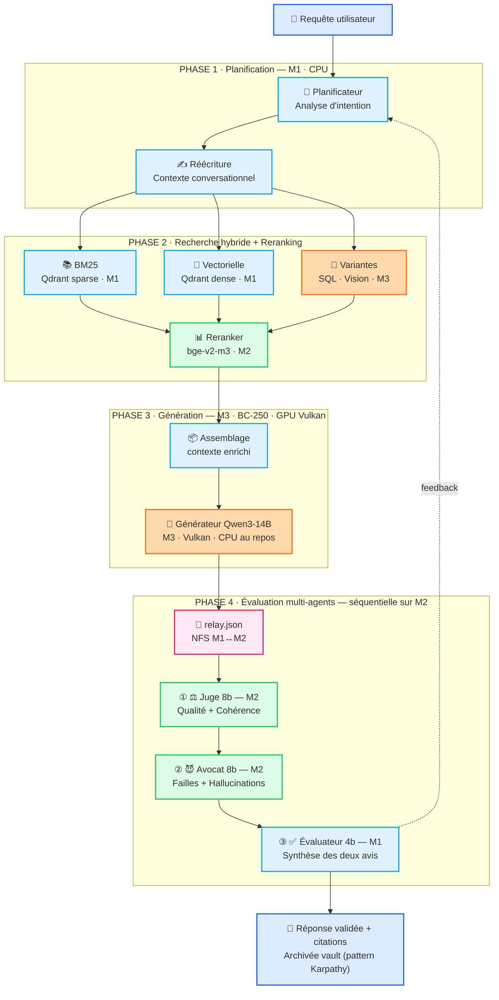
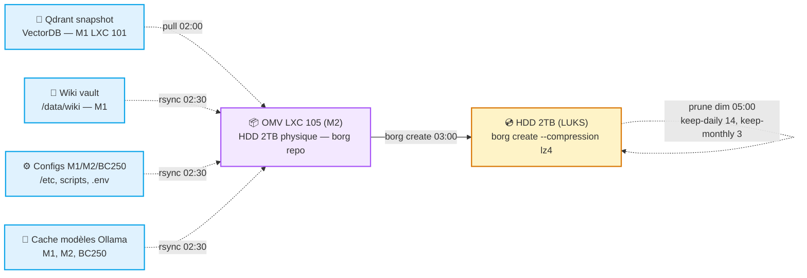
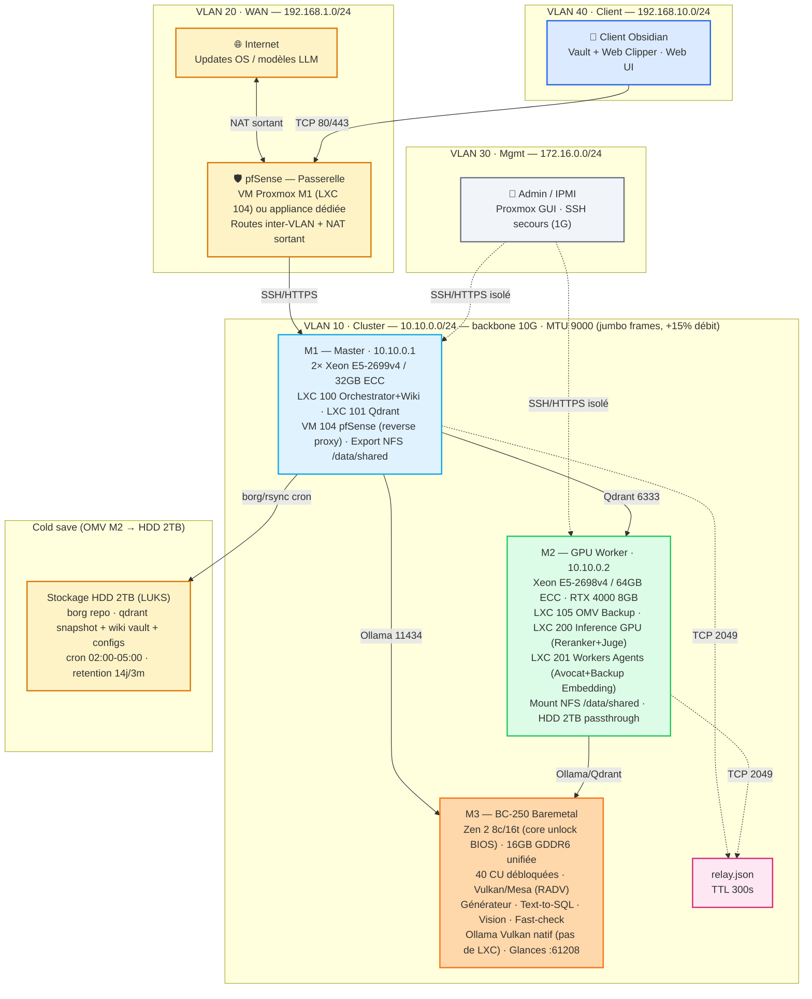
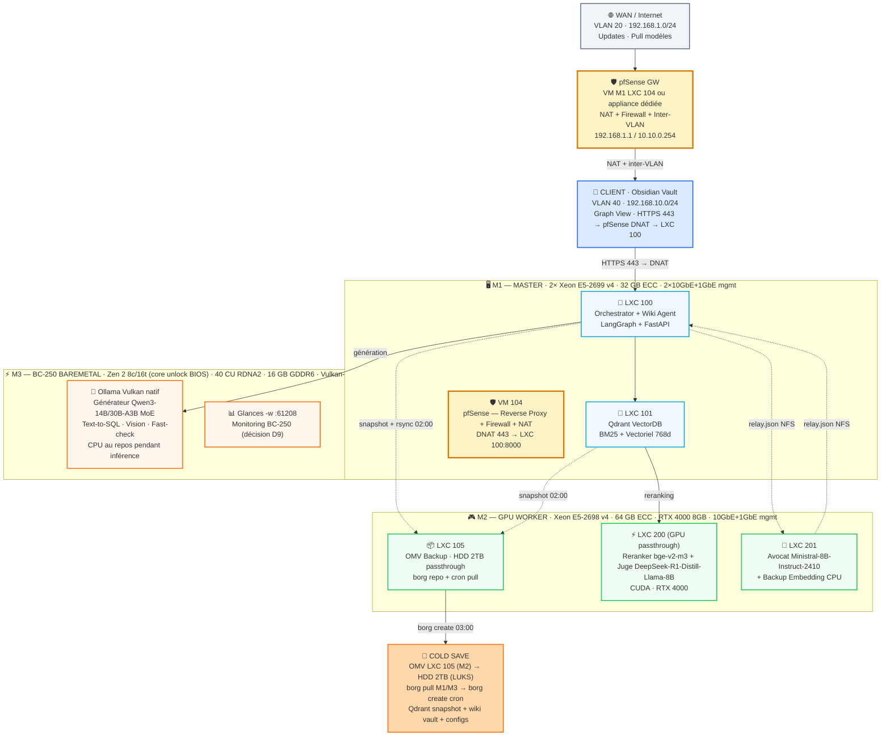

# 🧠 Cluster RAG Multi-Agents 100% Offline (Proxmox + AMD BC-250 + Obsidian Vault)


> ⚠️ **Statut réel** (voir [ROADMAP.md](ROADMAP.md)) : ce dépôt est au stade de **développement mock-first** — la conception documentaire est terminée, le squelette (settings, healthchecks, relay, injection_filter, infra Docker/Proxmox) est en place et **Sprint 1 (hygiène/CI) est terminé**. Le code métier (pipeline RAG, agents) reste à implémenter (ROADMAP Phases A-B), **sans matériel requis** : aucun LLM n'est pullé, tout est développé/testé avec des mocks (`httpx.MockTransport`). La boucle d'évaluation multi-agents est désactivée par défaut (`EVALUATION_ENABLED=false`, décision D12).

> ⚠️ **Correction hardware (29/07/2026)** : le BC-250 tourne sous **Vulkan (Mesa/RADV), pas ROCm** — AMD ne fournit pas de bibliothèques rocBLAS pour ce GPU (GFX1013). Sa mémoire est **16 GB GDDR6 unifiée** partagée CPU/GPU (pas 12 GB dédiés). Voir [docs communautaires BC-250](https://elektricm.github.io/amd-bc250-docs/) et le [guide AI akandr/bc250](https://github.com/akandr/bc250).

> ℹ️ **Beta test frontend** : voir `scripts/smoke_test_frontend_api.py` — validation automatisée API + frontend (33 scénarios, 33/33 PASSED). **`/api/embed`, `/api/query`, `/api/ingest` sont implémentés** (Phase A) mais renvoient `503` tant que les services (Ollama/Qdrant) ne sont pas démarrés en dehors du lifespan applicatif — couverture unitaire encore faible sur `ingestion.py`/`vector.py`/`lexical.py`/`reranker.py`/`ollama.py` (~30%). Seuls `/lint` et `/okf/*` restent de vrais stubs `NotImplementedError` (ROADMAP Phase B).

> ✅ **Alignement OKF v0.2 (30/07/2026)** : Frontmatter wiki migré vers format OKF v0.2 (Google Cloud, juin 2026). Champs clés : `type` (obligatoire), `verified` (trust tier : unverified/machine-confirmed/human-reviewed), `status` (draft/stable/deprecated), `stale_after` (date), `sources` enrichis (crédibilité par source). Structure vault OKF : `index.md` (§8) + `log.md` (§9). CLI `okf` + plugin Obsidian `okf-enforcer` identifiés — **pas de dépendance dure tant que pré-1.0** (lecture/écriture frontmatter gérée nativement dans Wiki Agent).

---

## 🚦 Statut de développement (31/07/2026)

| Bloc | État |
|---|---|
| Conception documentaire (README, docs, diagrammes) | ✅ Terminée |
| Squelette (settings, `/health` `/ready`, relay.json, injection_filter) | ✅ Implémenté — tests 16/16 |
| Sprint 1 Hygiène/CI (ruff 0, mypy 4 résiduelles sur `main.py`, .gitattributes, nginx/LXC 102-103 retirés) | ⚠️ **Quasi terminé** — ruff 0 erreur ✅, mypy 4 erreurs résiduelles (`response_model` vs `JSONResponse` d'erreur sur `/embed` `/ingest` `/query`) |
| **Phase A — Pipeline RAG core** (OllamaClient, VectorService, Ingestion, endpoints) | ⏳ **EN COURS** (mock-first, D10) |
| **Phase B — Multi-agents** (Planner, Judge/Advocate/Evaluator, build_graph) | ⏳ à faire |
| Phase C — Déploiement hardware (LXC, Ollama, OMV, Glances) | ⏳ bloquée (machines à livrer) |
| Phase D — CI + finalisation | ⏳ à faire |

**Stratégie (D10-D12)** : développement **mock-first** — aucun LLM pullé avant déploiement, tout se teste via `httpx.MockTransport` + Qdrant mocké. Boucle d'évaluation multi-agents **optionnelle** (`EVALUATION_ENABLED=false` par défaut). Ordre : **RAG core d'abord, multi-agents ensuite** (cf. [ROADMAP.md](ROADMAP.md)).

---

## 📑 Table des matières

- [Vue d'ensemble](#-vue-densemble)
- [Architecture du Système](#️-architecture-du-système)
- [Cold Save](#-cold-save)
- [Topologie Réseau & Sécurité](#-topologie-réseau--sécurité)
- [Intégration avec Obsidian (pattern Karpathy)](#-intégration-avec-obsidian-pattern-karpathy)
- [Fonctionnalités Clés](#-fonctionnalités-clés)
- [Infrastructure Matérielle](#️-infrastructure-matérielle)
- [Stack Technique](#️-stack-technique)
- [Guide d'Installation](#-guide-dinstallation)
- [Utilisation](#-utilisation)
- [Roadmap](#️-roadmap)
- [Points de Vigilance DevOps](#️-points-de-vigilance-devops-risques-maîtrisés)
- [Contribuer](#-contribuer)
- [Licence](#-licence)

---

## 🌍 Vue d'ensemble

Dans un contexte où la confidentialité des données et la souveraineté numérique sont cruciales, ce projet vise une alternative robuste aux API cloud propriétaires.

Contrairement aux RAG classiques qui se contentent de générer une réponse, ce système intègre une **couche d'évaluation multi-agents** inspirée des processus de révision humains. Après la génération, un **« Juge »** évalue la qualité, tandis qu'un **« Avocat du diable »** cherche activement les failles logiques ou les hallucinations. Un **« Évaluateur »** final synthétise ces avis avant de retourner la réponse à l'utilisateur.

**Frontend cible** : un vault Obsidian maintenu par le cluster — l'orchestrateur écrit et met à jour des pages markdown interreliées (`index.md`, `log.md`, entités, concepts, synthèses) directement dans un dossier vault. L'utilisateur consulte le graphe de connaissances, les pages et les liens via l'interface Obsidian. Aucune app Tauri/React à maintenir.

---

## 🏗️ Architecture du Système

Voir aussi le schéma complet dans [`docs/architecture.md`](docs/architecture.md) (mapping des composants sur les 3 machines du cluster).

### Légende des couleurs (commune à tous les diagrammes)

| Couleur | Rôle | Machine |
|---|---|---|
| 🔵 | Frontend / Entrées-Sorties | Client (Obsidian) |
| 🩵 | Orchestration, API, VectorDB, Embedding CPU, Évaluateur, NFS | **M1** Master |
| 🟢 | Reranker, Juge, Avocat, Backup Embedding CPU | **M2** GPU Worker + Services |
| 🟠 | Générateur, Text-to-SQL, Vision, Fast-check | **M3** BC-250 Baremetal |
| 🩷 | `relay.json` (NFS partagé M1↔M2) | Évaluation séquentielle |
| 🟡 | Backup / Passerelle | Cold save (M1), pfSense |

**Conventions de flèches** : `──▶` flux synchrone · `┄┄▶` asynchrone, feedback ou backup.

### 🗺️ Vue d'ensemble du cluster



### 📥 Flux d'ingestion (offline, asynchrone)

L'ingestion n'est **jamais dans le chemin critique** d'une requête : chunking, embedding et indexation tournent en batch sur le CPU de M1.



### 🔄 Flux de requête & évaluation multi-agents



---

## 🔐 Cold Save (via OMV sur Machine 2)

### Architecture



### Stratégie 2-1 (NVMe + HDD)

| Niveau | Support | Contenu | Fréquence | Outil |
|--------|---------|---------|-----------|-------|
| **Prod** | M1: 1 TB NVMe | Proxmox, LXCs, Qdrant, Wiki | — | — |
| | M2: 1 TB NVMe | Proxmox, LXCs, Ollama cache | — | — |
| | BC250: 475 GB NVMe | OS Debian, Modèles (9-11 GB) | — | — |
| **Backup** | HDD 2TB dans M2 (OMV LXC 105) | Qdrant snapshots, Wiki rsync, Configs, Ollama models cache | Quotidien (cron 02:00-05:00) | borg pull → borg create |

**Règle 2-1** : 2 copies (Prod NVMe + OMV HDD) · 2 médias (NVMe + HDD) · **Pas d'off-site planifié** (rotation manuelle si besoin).

### Flux Backup (cron OMV — heures creuses IA)

```
02:00  Qdrant snapshot create (atomique) → OMV pull
02:30  Rsync : wiki vault + configs M1/M2/BC250 + Ollama cache → OMV
03:00  Borg create --compression lz4 → HDD 2TB (LUKS)
05:00 (dim) Borg prune --keep-daily 14 --keep-monthly 3
```

### Outils

| Outil | Usage |
|---|---|
| borg | Sauvegarde dédupliquée, chiffrée (repokey), compression LZ4 |
| qdrant snapshot | Backup atomique VectorDB |
| rsync | Sync incrémental wiki/configs/cache modèles |
| OMV | UI web gestion stockage, SMART, notifications, borg frontend |

---

## 🌐 Topologie Réseau & Sécurité



### VLAN / Sous-réseaux

| VLAN | CIDR | Usage | Machines |
|---|---|---|---|
| 10 (Cluster) | `10.10.0.0/24` | Backbone 10G inter-nœuds (Qdrant, Ollama API, NFS) | M1, M2, M3 |
| 20 (WAN) | `192.168.1.0/24` | pfSense → Internet (updates, modèles) | pfSense GW |
| 30 (Mgmt) | `172.16.0.0/24` | Proxmox GUI, IPMI, SSH secours (1G) | M1, M2, M3 |
| 40 (Client) | `192.168.10.0/24` | Obsidian client, Web UI | Client, pfSense |

**Passerelle** : pfSense (VM sur Proxmox M1 — LXC 104 — ou appliance dédiée) — routes inter-VLAN + NAT sortant.

### NFS Relay (évaluation)

- **Export M1 (hôte)** : `/data/shared` → `10.10.0.0/24(rw,sync,no_subtree_check,no_root_squash)` sur `10.10.0.1`
- **Mount M2** : `/data/shared` sur `10.10.0.1:/data/shared` (fstab, `_netdev`)
- **Fichier** : `evaluation-relay.json` (verrou fichier atomique, TTL 300 s)

> ⚠️ **Note** : Le NFS pour l'évaluation est exporté par l'hôte M1 (`10.10.0.1`) pour simplicité et performance. Le cold save est assuré par **OMV LXC 105 sur Machine 2** (HDD 2TB passthrough, borg pull depuis M1/M3, cron 02:00-05:00).

### Règles Firewall (pfSense) — Flux autorisés

| Source | Dest | Proto/Port | Usage |
|---|---|---|---|
| `10.10.0.0/24` | `10.10.0.0/24` | TCP 6333 | Qdrant (VectorDB) |
| `10.10.0.0/24` | `10.10.0.0/24` | TCP 11434 | Ollama API (M2, M3) |
| `10.10.0.0/24` | `10.10.0.0/24` | TCP 2049/NFS | Relay évaluation + vault wiki |
| `10.10.0.2` | `10.10.0.1` | TCP 2049 | Mount NFS M1→M2 |
| `192.168.10.0/24` | `10.10.0.1` | TCP 80/443 | Client → pfSense (reverse proxy → LXC 100:8000) |
| `10.10.0.0/24` | `192.168.1.0/24` | TCP 80/443 | Sortie modèles/updates (via pfSense NAT) |
| `172.16.0.0/24` | *any* | SSH/HTTPS | Admin Proxmox/IPMI (isolé) |

**Reverse Proxy** : pfSense (VM 104 sur M1) — termine TLS, DNAT 443 → LXC 100:8000. Pas de nginx dédié.

**MTU** : 9000 (Jumbo frames) sur VLAN 10 pour NFS/Ollama/Qdrant — gain ~15 % débit gros transferts.

---

## 🔗 Intégration avec Obsidian (pattern Karpathy)

Le frontend est un **vault Obsidian standard** — le cluster écrit et met à jour des pages markdown structurées. L'utilisateur ouvre Obsidian, pointe vers le dossier vault, et navigue via le graphe de connaissances.

### Structure du Vault (`/data/wiki`)

```
wiki/
├── index.md              # Catalogue des pages
├── log.md                # Chronologie des interactions
├── entities/             # Personnes, lieux, organisations
├── concepts/             # Idées, thèmes, définitions
├── sources/              # Références originales (ingest)
└── synthesis/            # Analyses, comparatifs, rapports
```

### Convention Frontmatter YAML (aligné OKF v0.2)

```yaml
---
type: "entity|concept|source|synthesis|log|agent|workflow"  # CHAMP OBLIGATOIRE OKF v0.2
title: "Nom de la page"
description: "Résumé 1-2 phrases pour index/search"           # OKF v0.2
resource: "wiki"                                              # OKF v0.2 - type de ressource
tags: ["tag1", "tag2"]                                        # OKF v0.1 base
verified:                                                     # OKF v0.2 - trust tier (Évaluateur = human-reviewed)
  - reviewer: "evaluator-agent"
    status: "human-reviewed"      # unverified | machine-confirmed | human-reviewed
    timestamp: "2026-07-29T10:30:00Z"
status: "stable"                  # draft | stable | deprecated (lint endpoint)
stale_after: "2026-12-31"         # date fraîcheur (lint endpoint)
sources:                          # OKF v0.2 - crédibilité par source
  - uri: "source1.md"
    author: "wiki-agent"
    last_modified: "2026-07-29T10:30:00Z"
    credibility: "high"           # high | medium | low
  - uri: "https://example.com"
    author: "external"
    last_modified: "2026-07-29T10:30:00Z"
    credibility: "medium"
created: "2026-07-29T10:30:00Z"
updated: "2026-07-29T10:30:00Z"
version: 1
---
```

### Endpoints API

| Endpoint | Description |
|---|---|
| `POST /api/v1/ingest` | Envoie une source (fichier, URL, texte) → crée/MAJ pages wiki |
| `POST /api/v1/query` | Pose une question → réponse synthétisée + citations |
| `GET /api/v1/lint` | Health check wiki : pages orphelines, contradictions, gaps |
| `GET /api/v1/embed` | Embedding texte → vecteur dense 1024d + sparse appris (bge-m3) + fallback histogramme |

### Workflow Web Clipper

1. Obsidian Web Clipper (extension navigateur) convertit les articles web en markdown
2. Injection via `curl -X POST ${CLUSTER_API_URL}/api/v1/ingest -F "file=@article.md"`
3. Le cluster : chunk → embed → index → écrit pages wiki → MAJ `index.md` + `log.md`

Ressources : [Obsidian](https://obsidian.md) · [pattern Karpathy LLM Wiki](https://github.com/karpathy/LLMWiki) (inspiration).

---

## ⭐ Fonctionnalités Clés

- 🔒 **100 % Offline & Souverain** : aucune donnée ne quitte le réseau local.
- 🤖 **Évaluation Multi-Agents** : pattern « Juge + Avocat du diable » pour limiter les hallucinations.
- 🔍 **Recherche Hybride** : lexicale (BM25) + vectorielle (sémantique) + variantes (SQL, tables, vision).
- ⚡ **Orchestration Distribuée** : séparation orchestration / inférence GPU / stockage.
- 🛠️ **Hardware Atypique** : exploitation de la puce AMD BC-250 (jusqu'à 40 CUs après unlock) via Vulkan/Mesa.
- 🧠 **Frontend Obsidian Vault** : graphe de connaissances, web clipper, pages markdown maintenues par le cluster en continu.
- 🔄 **Boucle de Feedback** : l'évaluateur peut renvoyer de l'information au planificateur.

---

## 🖥️ Infrastructure Matérielle

| Nœud | Rôle | CPU / RAM | GPU / Accélérateur | Virtualisation |
|---|---|---|---|---|
| **Machine 1** | **Master** (Orchestration, API, VectorDB, Évaluateur, Embedding CPU, Relay NFS) | 2× Xeon E5-2699 v4 / **32 GB ECC** | **AMD Radeon RX 580** (8 GB) — fallback léger uniquement | Proxmox VE 9.3 (LXC 100, 101, VM 104*) |
| **Machine 2** | **GPU Worker + Services** (Inference, Reranking, Juge, Avocat, Backup Embedding CPU, Backup) | 1× Xeon E5-2698 v4 / **64 GB ECC** | **NVIDIA Quadro RTX 4000** (8 GB VRAM dédiée) | Proxmox VE 9.3 (LXC 105, 200 privilégié GPU, 201) |
| **Machine 3** | **BC-250 Baremetal** (Générateur, Text-to-SQL, Vision, Fast-check) | Carte minage BIOS modifiée · Puce PS5 (BC-250, Zen 2, **8c/16t** — core unlock non persistant, via service systemd `bc250-core-unlock.service` au boot [rw-r-r-0644/bc250-core-unlock](https://github.com/rw-r-r-0644/bc250-core-unlock)) · BIOS moddé [Forbidden-Darkness](https://github.com/Forbidden-Darkness/AMD-BC-250-UEFI-v2.2-Firmware-Menu-Script) pour carve-out VRAM dynamique 512 MB uniquement · **40 CU GPU** via [duggasco/bc250-40cu-unlock](https://github.com/duggasco/bc250-40cu-unlock) | **16 GB GDDR6 unifiée** CPU+GPU · ~12 GB dispo pour IA (512 MB carve-out dynamique) | **Debian 12 (bookworm) stable** · Ollama Vulkan natif · Mesa 25.1+ via backports |
| **Client** | Obsidian Vault (visualisation + ingestion) | Poste de travail | – | Native (Electron) |

\* VM 104 = pfSense (reverse proxy + firewall + NAT), uniquement si pas d'appliance dédiée.

### Stockage

| Machine | Disque | Usage |
|---|---|---|
| M1 (Master) | 1 TB NVMe | Proxmox + LXCs + Qdrant + Wiki + Relay NFS |
| M2 (GPU Worker + Services) | 1 TB NVMe + **HDD 2TB** | Proxmox + LXCs + cache Ollama + **OMV Backup LXC 105 (cold save)** |
| M3 (BC-250) | 475 GB NVMe | OS Debian + Modèles |

### ⚡ Règle d'or BC-250

> **Le CPU du BC-250 est le serviteur du GPU.** Toute charge CPU significative sur M3 est un vol de bande passante mémoire au Générateur 14B. Le CPU (Zen 2 8c/16t) doit rester au repos (ou charge minimale) quand le GPU fait de l'inférence Vulkan. **Embedding = Machine 1 CPU (principal) / Machine 2 CPU (backup).**
>
> **Preuve** : le BC-250 a 16 GB GDDR6 *unifiée* (CPU+GPU, même pool, même bande passante). Si le CPU est chargé (embedding, batch, compilation) :
> - **Contention bande passante mémoire** → le GPU 14B est affamé
> - **Pression thermique** → CPU + GPU = jusqu'à 235 W TDP dans un format compact → throttling certain
> - **VRAM effective réduite** → le modèle 14B perd des ressources critiques
>
> Références : [AMD BC-250 Documentation](https://elektricm.github.io/amd-bc250-docs/) — Unified Memory Architecture, Vulkan-only, 40 CU unlock · [akandr/bc250](https://github.com/akandr/bc250) — Ollama + Vulkan benchmarks, GFX1013, roofline analysis

### Répartition LXC prévue

| Machine | LXC | Rôle |
|---|---|---|
| Machine 1 | `100` | Orchestrator + Wiki Agent |
| | `101` | Vector DB (Qdrant) |
| | `104` | pfSense (VM) — Reverse proxy + Firewall + NAT |
| | | **~18.5 GB / 32 GB utilisés** (6 GB libérés) |
| Machine 2 | `105` | **OMV Backup (HDD 2TB passthrough)** |
| | `200` | Inference GPU (passthrough RTX 4000) — Reranker + Juge |
| | `201` | Workers Agents — Avocat + Backup Embedding CPU |
| Machine 3 | — | Ollama Vulkan natif (pas de LXC) |

### Résumé machines M1 & M2

| Machine | IP (VLAN 10) | Rôle | Hardware | Services |
|---------|-------------|------|----------|----------|
| **M1** (Master) | `10.10.0.1` | Orchestration, API, VectorDB, Embedding CPU, Évaluateur, NFS | 2× Xeon E5-2699 v4 32c/64t, 32 GB ECC, 1 TB NVMe | Qdrant (LXC 101 :6333), Ollama CPU (nomic-embed + évaluateur), pfSense VM 104 (reverse proxy, firewall, NAT) |
| **M2** (GPU Worker + Services) | `10.10.0.2` | Reranker, Juge, Avocat, Backup Embedding CPU, **OMV Backup** | Xeon 20c/40t, 64 GB ECC, **1 TB NVMe + HDD 2TB**, RTX 4000 (CUDA) | Ollama GPU (LXC 200-201 :11434), OMV LXC 105 (borg/rsync cron) |

**Endpoints :** Ollama M1 = `http://10.10.0.1:11434`, Ollama M2 = `http://10.10.0.2:11434`, Qdrant = `http://10.10.0.1:6333`, Gateway = `10.10.0.1:80/443`

### 🖥️ Topologie physique : machines, LXC & flux



---

## 🛠️ Stack Technique

- **Infrastructure** : Proxmox VE 9.3, LXC, Docker, Docker Compose
- **IA & LLM (Machine 2, RTX 4000)** : Ollama, CUDA, modèles open-weight (Qwen3.5, Mistral, BGE)
- **IA & LLM (Machine 3, BC-250)** : Ollama + backend **Vulkan** (`OLLAMA_VULKAN=1`), Mesa/RADV 25.1+ — **pas ROCm** (non supporté sur GFX1013)
- **IA & LLM (Machine 1)** : embedding `bge-m3` (dense + sparse appris) sur **CPU Xeon (principal)**, en complément de BM25 (lexical exact via Qdrant) ; RX 580 en **fallback léger uniquement** (OpenCL si besoin)
- **Orchestration Agents** : **LangGraph** (choix tranché — graphe d'état explicite, parallélisme natif, checkpointing)
- **Vector Store & DB** : **Qdrant** (hybrid search natif), PostgreSQL, Redis
- **API & Backend** : FastAPI, **pfSense (reverse proxy, TLS termination, DNAT)**
- **Frontend** : **Obsidian Vault** (pattern Karpathy) — pages markdown maintenues par le cluster, visualisation via Obsidian (Electron)
- **Observabilité** : graphs natifs Proxmox (M1/M2) + **Glances** sur BC-250 (M3) — stack Prometheus/Grafana/Loki retirée (décision D9)

---

## 🚀 Guide d'Installation

> Le guide complet et détaillé se trouve dans **[`docs/deployment-guide.md`](docs/deployment-guide.md)** — commandes pas-à-pas pour les 3 machines, post-install, LXC, Docker, Ollama.

### Résumé

```bash
# 1. LXC Proxmox
cd infrastructure/proxmox
bash create-lxc-master.sh   # M1 : LXC 100 (Orchestrator), 101 (Vector DB), 104 (pfSense VM)
bash create-lxc-gpu.sh      # M2 : LXC 105 (OMV), 200 (GPU passthrough), 201 (Workers)

# 2. Stacks Docker
cd infrastructure/docker
docker compose -f docker-compose.vector-db.yml up -d     # LXC 101
docker compose -f docker-compose.orchestrator.yml up -d  # LXC 100
docker compose -f docker-compose.omv.yml up -d           # LXC 105

# 3. BC-250 baremetal
cd infrastructure/bc250
bash setup-vulkan-stack.sh
bash enable-40cu-unlock.sh   # optionnel

# 4. Ollama
curl -fsSL https://ollama.com/install.sh | sh
ollama pull hf.co/Qwen/Qwen3-14B-GGUF:Q4_K_M  # Générateur (M3)
ollama pull hf.co/bartowski/DeepSeek-R1-Distill-Llama-8B-GGUF:Q4_K_M           # Judge (M2)
ollama pull hf.co/bartowski/Ministral-8B-Instruct-2410-GGUF:Q4_K_M # Avocat (M2)
ollama pull hf.co/nomic-ai/nomic-embed-text-v2-moe-GGUF:Q8_0  # Embedding (M1)
```

> Voir [`docs/deployment-guide.md`](docs/deployment-guide.md) pour les commandes complètes, les allocations mémoire/vCPU, la config GPU passthrough, et les scripts de post-installation.

---

## 💻 Utilisation

### Via API (cURL)

```bash
curl -X POST "${CLUSTER_API_URL}/api/v1/query" \
  -H "Content-Type: application/json" \
  -d '{
    "question": "Quelle est la stratégie de déploiement recommandée pour le BC250 ?",
    "context": "infrastructure"
  }'
```

`CLUSTER_API_URL` est défini dans `.env` (voir `.env.example`) — **ne jamais coder l'IP du cluster en dur** dans les exemples ou les scripts commités.

### Via Obsidian

- Ouvrir le vault Obsidian sur le poste client (vault partagé avec le cluster)
- Naviguer dans les pages wiki (`index.md`, `entities/`, `concepts/`, `sources/`)
- Utiliser le **graphe de connaissances** (Obsidian Graph View) pour explorer les liens
- Les pages sont mises à jour automatiquement par le cluster via les endpoints API

```bash
# Ajouter une source
curl -X POST ${CLUSTER_API_URL}/api/v1/ingest -F "file=@article.md"
# Poser une question
curl -X POST ${CLUSTER_API_URL}/api/v1/query -d '{"question":"..."}'
```

---

## 🗺️ Roadmap

Voir [ROADMAP.md](ROADMAP.md) pour le détail et l'état réel d'avancement (rien n'est encore fait — ce projet part de zéro sur le code, seule la conception documentaire existe).

> ✅ **Déjà tranché** : Choix CrewAI vs LangGraph → **LangGraph**. OS M3 → **Debian 12 stable** (décision 03/08/2026, revu — core-unlock CPU via systemd, pas BIOS persistant).

---

## ⚠️ Points de Vigilance DevOps (Risques Maîtrisés)

| **SPOF : Machine 1 (Master)** | Qdrant + API + Wiki + Évaluateur + NFS = tout s'arrête si M1 tombe | Cold save périodique (Qdrant snapshot + wiki vault + configs) vers OMV M2 → HDD 2TB. pfSense VM sur M1. |
| **Résilience M2** | OMV backup sur M2 → si M2 tombe, cold save stoppé | Aucun impact sur la prod (M1/M3 continuent de tourner). Reprise manuelle quand M2 remonte. |
| **Latence NFS sur évaluation** | Relay file = point de synchronisation bloquant | MTU 9000 + 10 GbE = <1 ms RTT. Timeout 120 s Juge → Avocat. Acceptable. |
| **BC-250 baremetal = pas de snapshot/rollback** | Mise à jour noyau/BIOS risquée | Tests sur VM simulée d'abord. Backup config `/etc` + BIOS d'origine sur USB. |
| **RTX 4000 8 GB limite dure** | Pas de place pour un modèle > 7B quantifié | Choix validé : Juge/Avocat 7B max. Si besoin 14B → seul le BC-250 peut. |
| **Modèles non verrouillés (tags Ollama)** | `pull hf.co/bartowski/DeepSeek-R1-Distill-Llama-8B-GGUF:Q4_K_M` = version mobile → reproductibilité | Fixer digests SHA256 dans `.env` / `docker-compose`. `ollama pull hf.co/bartowski/DeepSeek-R1-Distill-Llama-8B-GGUF:Q4_K_M@sha256:...` |
| **Concurrency lock vault Obsidian** | Client + cluster écrivent simultanément | NFS `no_root_squash` + file locking (fcntl). Ou versioning git sidecar. |

### Recommandations immédiates

1. **Lock les versions modèles** — Ajouter dans `.env` : `OLLAMA_MODEL_JUDGE=hf.co/bartowski/DeepSeek-R1-Distill-Llama-8B-GGUF:Q4_K_M@sha256:xxx` etc.
2. **Health checks obligatoires** — `/health` sur chaque service (Ollama, Qdrant, API) — consultation via `curl`/Glances, Prometheus retiré (D9).
3. **Secrets management** — Pas de tokens/API keys en dur. `sops` + `.env.encrypted` ou Vault (Phase 7).
4. **Cold save Qdrant + wiki + configs** — `qdrant snapshot create` + rsync → OMV M2 → borg repo HDD 2TB (cron 02:00-05:00).
5. **Test de charge pré-prod** — `hey` / `locust` sur `/api/v1/query` avec 10-50 RPS avant mise en prod.
6. **Runbook incident** — Documenter : « BC-250 ne boot plus », « RTX 4000 OOM », « NFS stale handle », « Qdrant corruption », « OMV HDD failure ».

---

## 🤝 Contribuer

1. Fork le projet
2. Créer une branche (`git checkout -b feature/AmazingFeature`)
3. Committer (`git commit -m 'Add some AmazingFeature'`)
4. Push (`git push origin feature/AmazingFeature`)
5. Ouvrir une Pull Request

## 📄 Licence

Ce projet est distribué sous licence MIT — voir [LICENSE](LICENSE).

## 🙏 Remerciements

- [karpathy](https://github.com/karpathy) pour le pattern [LLM Wiki](https://github.com/karpathy/LLMWiki), qui inspire l'architecture frontend
- La communauté Proxmox et la communauté BC-250 ([elektricM/amd-bc250-docs](https://github.com/elektricM/amd-bc250-docs), [akandr/bc250](https://github.com/akandr/bc250), [duggasco/bc250-40cu-unlock](https://github.com/duggasco/bc250-40cu-unlock)) pour le support hardware atypique
- La communauté open-source IA pour les modèles open-weight

*Développé pour l'IA souveraine, le hardware open-source et les seconds cerveaux locaux (Obsidian + LLM).*
