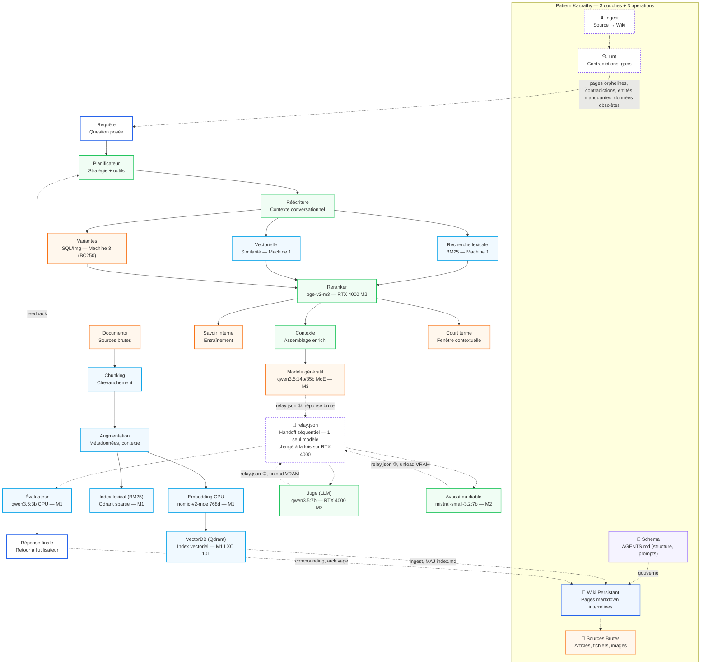
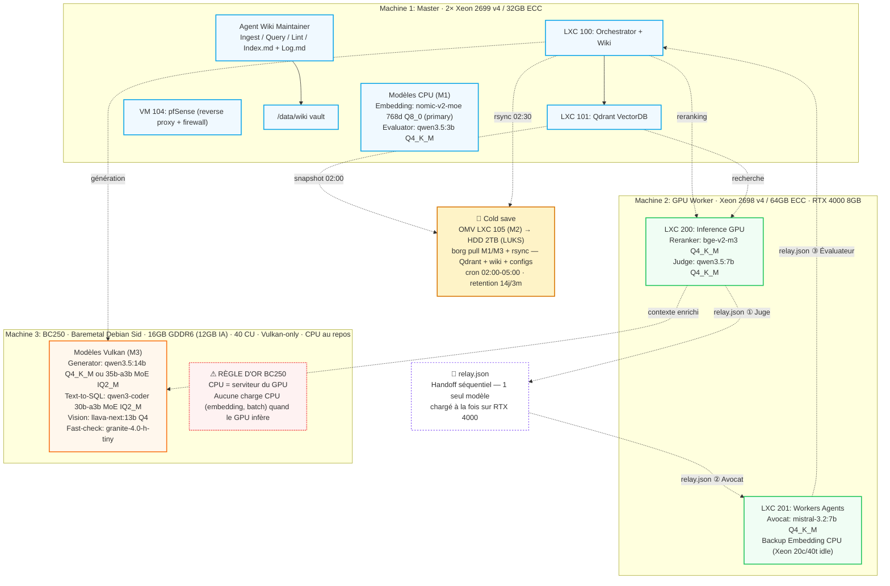

# Architecture RAG multi-agents

> Cluster Proxmox 3 nœuds : Machine 1 Master (Xeon CPU embedding + Qdrant + Wiki), Machine 2 GPU Worker (RTX 4000 Reranker/Juge/Avocat), Machine 3 BC-250 baremetal (Vulkan-only Generator 14B/MoE + Text-to-SQL + Vision). BC-250 CPU au repos.

## Flux logique — pattern Karpathy, ingestion, requête

## Mapping infrastructure — cluster (3 machines)

