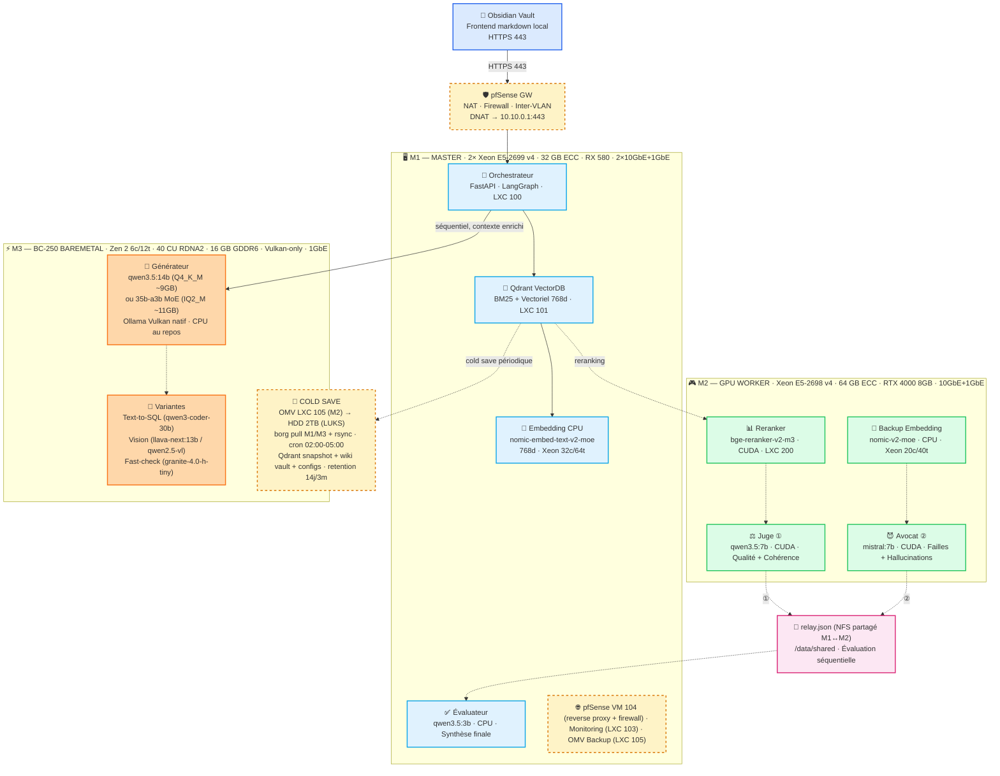

```mermaid
flowchart TB
    classDef frontend fill:#dbeafe,stroke:#2563eb,stroke-width:2px
    classDef m1 fill:#e0f2fe,stroke:#0ea5e9,stroke-width:2px
    classDef m2 fill:#dcfce7,stroke:#22c55e,stroke-width:2px
    classDef m3 fill:#fed7aa,stroke:#f97316,stroke-width:2px
    classDef relay fill:#fce7f3,stroke:#db2777,stroke-width:2px
    classDef backup fill:#fef3c7,stroke:#d97706,stroke-width:2px,stroke-dasharray: 5 5

    Client["🧠 Obsidian Vault<br/>Frontend markdown local<br/>HTTPS 443"]:::frontend
    GW["🛡️ pfSense GW<br/>NAT · Firewall · Inter-VLAN<br/>DNAT → 10.10.0.1:443"]:::backup

    subgraph M1["🖥️ M1 — MASTER · 2× Xeon E5-2699 v4 · 32 GB ECC · RX 580 · 2×10GbE+1GbE"]
        Orch["🎯 Orchestrateur<br/>FastAPI · LangGraph · LXC 100"]:::m1
        Qdrant["💾 Qdrant VectorDB<br/>BM25 + Vectoriel 768d · LXC 101"]:::m1
        Embed["🔢 Embedding CPU<br/>nomic-embed-text-v2-moe<br/>768d · Xeon 32c/64t"]:::m1
        Eval["✅ Évaluateur<br/>qwen3.5:3b · CPU · Synthèse finale"]:::m1
        Gate["🌐 pfSense VM 104 (reverse proxy + firewall) · Monitoring (LXC 103) · OMV Backup (LXC 105)"]:::backup
    end

    subgraph M2["🎮 M2 — GPU WORKER · Xeon E5-2698 v4 · 64 GB ECC · RTX 4000 8GB · 10GbE+1GbE"]
        Rerank["📊 Reranker<br/>bge-reranker-v2-m3 · CUDA · LXC 200"]:::m2
        Judge["⚖️ Juge ①<br/>qwen3.5:7b · CUDA · Qualité + Cohérence"]:::m2
        Advocate["😈 Avocat ②<br/>mistral:7b · CUDA · Failles + Hallucinations"]:::m2
        BackupEmbed["🔢 Backup Embedding<br/>nomic-v2-moe · CPU · Xeon 20c/40t"]:::m2
    end

    subgraph M3["⚡ M3 — BC-250 BAREMETAL · Zen 2 6c/12t · 40 CU RDNA2 · 16 GB GDDR6 · Vulkan-only · 1GbE"]
        Gen["🤖 Générateur<br/>qwen3.5:14b (Q4_K_M ~9GB)<br/>ou 35b-a3b MoE (IQ2_M ~11GB)<br/>Ollama Vulkan natif · CPU au repos"]:::m3
        Variants["🔀 Variantes<br/>Text-to-SQL (qwen3-coder-30b)<br/>Vision (llava-next:13b / qwen2.5-vl)<br/>Fast-check (granite-4.0-h-tiny)"]:::m3
    end

    Relay["📄 relay.json (NFS partagé M1↔M2)<br/>/data/shared · Évaluation séquentielle"]:::relay
    Cold["🧊 COLD SAVE<br/>OMV LXC 105 (M2) → HDD 2TB (LUKS)<br/>borg pull M1/M3 + rsync · cron 02:00-05:00<br/>Qdrant snapshot + wiki vault + configs · retention 14j/3m"]:::backup

    Client -->|HTTPS 443| GW --> Orch
    Orch --> Qdrant --> Embed
    Orch -->|séquentiel, contexte enrichi| Gen
    Gen -.-> Variants
    Qdrant -.->|reranking| Rerank
    Rerank -.-> Judge
    Judge -.->|①| Relay
    Advocate -.->|②| Relay
    Relay -.-> Eval
    BackupEmbed -.-> Advocate
    Qdrant -.->|cold save périodique| Cold

    %% RÈGLE D'OR BC-250 : le CPU est le serviteur du GPU.
    %% Toute charge CPU = vol de bande passante mémoire au Générateur 14B.
    %% Embedding = M1 CPU (principal) / M2 CPU (backup).
```
