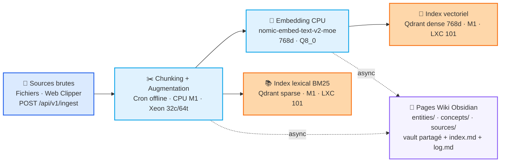

```mermaid
flowchart LR
    classDef src fill:#dbeafe,stroke:#2563eb,stroke-width:2px
    classDef cpu fill:#e0f2fe,stroke:#0ea5e9,stroke-width:2px
    classDef store fill:#fed7aa,stroke:#f97316,stroke-width:2px
    classDef wiki fill:#f5f3ff,stroke:#8b5cf6,stroke-width:2px

    Sources["📄 Sources brutes<br/>Fichiers · Web Clipper<br/>POST /api/v1/ingest"]:::src
    Chunk["✂️ Chunking + Augmentation<br/>Cron offline · CPU M1 · Xeon 32c/64t"]:::cpu
    Embed["🔢 Embedding CPU<br/>nomic-embed-text-v2-moe<br/>768d · Q8_0"]:::cpu
    BM25["📚 Index lexical BM25<br/>Qdrant sparse · M1 · LXC 101"]:::store
    Vec["💾 Index vectoriel<br/>Qdrant dense 768d · M1 · LXC 101"]:::store
    Wiki["🧠 Pages Wiki Obsidian<br/>entities/ · concepts/ · sources/<br/>vault partagé + index.md + log.md"]:::wiki

    Sources --> Chunk
    Chunk --> BM25
    Chunk --> Embed --> Vec
    Embed -.->|async| Wiki
    Chunk -.->|async| Wiki

    %% Traitement 100% batch · asynchrone · hors chemin critique requête
    %% Parallélisable sur Xeon 32c/64t
```
