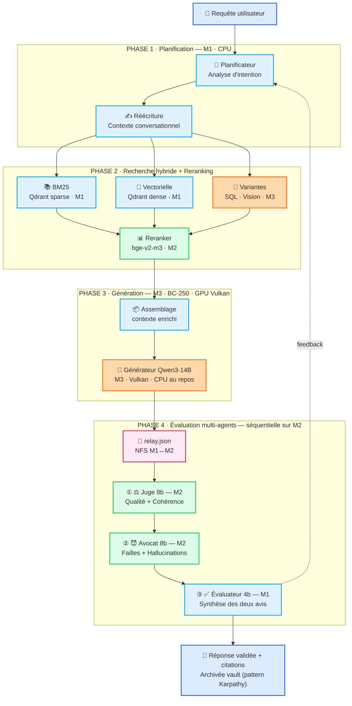

```mermaid
flowchart TB
    classDef m1 fill:#e0f2fe,stroke:#0ea5e9,stroke-width:2px
    classDef m2 fill:#dcfce7,stroke:#22c55e,stroke-width:2px
    classDef m3 fill:#fed7aa,stroke:#f97316,stroke-width:2px
    classDef relay fill:#fce7f3,stroke:#db2777,stroke-width:2px
    classDef front fill:#dbeafe,stroke:#2563eb,stroke-width:2px

    Query["💬 Requête utilisateur"]:::front

    subgraph P1["PHASE 1 · Planification — M1 · CPU"]
        Plan["🎯 Planificateur<br/>Analyse d'intention"]:::m1
        Rewrite["✍️ Réécriture<br/>Contexte conversationnel"]:::m1
    end

    subgraph P2["PHASE 2 · Recherche hybride + Reranking"]
        BM25["📚 BM25<br/>Qdrant sparse · M1"]:::m1
        VecSearch["💾 Vectorielle<br/>Qdrant dense · M1"]:::m1
        Variants["🔀 Variantes<br/>SQL · Vision · M3"]:::m3
        Rerank["📊 Reranker<br/>bge-v2-m3 · M2"]:::m2
    end

    subgraph P3["PHASE 3 · Génération — M3 · BC-250 · GPU Vulkan"]
        Assemble["📦 Assemblage<br/>contexte enrichi"]:::m1
        Gen["🤖 Générateur Qwen3-14B<br/>M3 · Vulkan · CPU au repos"]:::m3
    end

    subgraph P4["PHASE 4 · Évaluation multi-agents — séquentielle sur M2"]
        Relay["📄 relay.json<br/>NFS M1↔M2"]:::relay
        Judge["① ⚖️ Juge 8b — M2<br/>Qualité + Cohérence"]:::m2
        Advocate["② 😈 Avocat 8b — M2<br/>Failles + Hallucinations"]:::m2
        Evaluator["③ ✅ Évaluateur 4b — M1<br/>Synthèse des deux avis"]:::m1
    end

    Answer["🎉 Réponse validée + citations<br/>Archivée vault (pattern Karpathy)"]:::front

    Query --> Plan --> Rewrite
    Rewrite --> BM25
    Rewrite --> VecSearch
    Rewrite --> Variants
    BM25 --> Rerank
    VecSearch --> Rerank
    Variants --> Rerank
    Rerank --> Assemble --> Gen --> Relay
    Relay --> Judge --> Advocate --> Evaluator
    Evaluator -.->|feedback| Plan
    Evaluator --> Answer

    %% Conventions : trait plein = synchrone, pointillé = asynchrone/feedback
    %% ①②③ étapes séquentielles de l'évaluation (1 seul modèle chargé à la fois sur RTX 4000)
```
