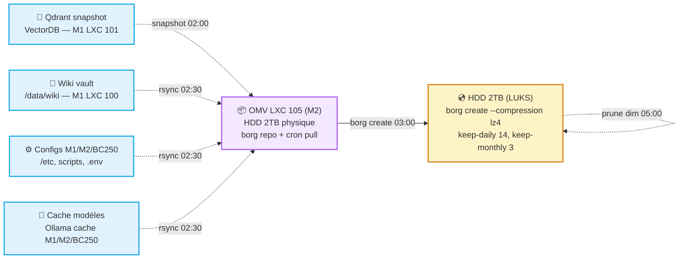

```mermaid
flowchart LR
    classDef prod fill:#e0f2fe,stroke:#0ea5e9,stroke-width:2px
    classDef omv fill:#f3e8ff,stroke:#a855f7,stroke-width:2px
    classDef cold fill:#fef3c7,stroke:#d97706,stroke-width:2px

    Qdrant["💾 Qdrant snapshot<br/>VectorDB — M1 LXC 101"]:::prod
    Wiki["🧠 Wiki vault<br/>/data/wiki — M1 LXC 100"]:::prod
    Configs["⚙️ Configs M1/M2/BC250<br/>/etc, scripts, .env"]:::prod
    Models["🤖 Cache modèles<br/>Ollama cache M1/M2/BC250"]:::prod

    OMV["📦 OMV LXC 105 (M2)<br/>HDD 2TB physique<br/>borg repo + cron pull"]:::omv
    HDD["💿 HDD 2TB (LUKS)<br/>borg create --compression lz4<br/>keep-daily 14, keep-monthly 3"]:::cold

    Qdrant -.->|snapshot 02:00| OMV
    Wiki -.->|rsync 02:30| OMV
    Configs -.->|rsync 02:30| OMV
    Models -.->|rsync 02:30| OMV
    OMV -->|borg create 03:00| HDD
    HDD -.->|prune dim 05:00| HDD

    %% OS, LXC, modèles = reproductibles depuis le repo (scripts d'install + pull Ollama) : non sauvegardés.
    %% Seules les données non reproductibles (index Qdrant, wiki, configs) sont sauvegardées.
    %% OMV LXC 105 sur Machine 2 avec HDD 2TB passthrough.
    %% Borg repo LUKS avec repokey.
```