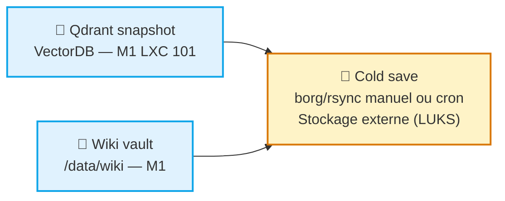

```mermaid
flowchart LR
    classDef prod fill:#e0f2fe,stroke:#0ea5e9,stroke-width:2px
    classDef cold fill:#fef3c7,stroke:#d97706,stroke-width:2px

    Qdrant["💾 Qdrant snapshot<br/>VectorDB — M1 LXC 101"]:::prod
    Wiki["🧠 Wiki vault<br/>/data/wiki — M1"]:::prod
    Cold["🧊 Cold save<br/>borg/rsync manuel ou cron<br/>Stockage externe (LUKS)"]:::cold

    Qdrant --> Cold
    Wiki --> Cold

    %% OS, LXC, modèles = reproductibles depuis le repo (scripts d'install + pull Ollama) : non sauvegardés.
    %% Seules les données non reproductibles (index Qdrant + wiki généré) sont sauvegardées.
    %% Pas de tier "backup live" dédié (OMV/LXC 105) : cold save déclenché directement depuis M1.
```
