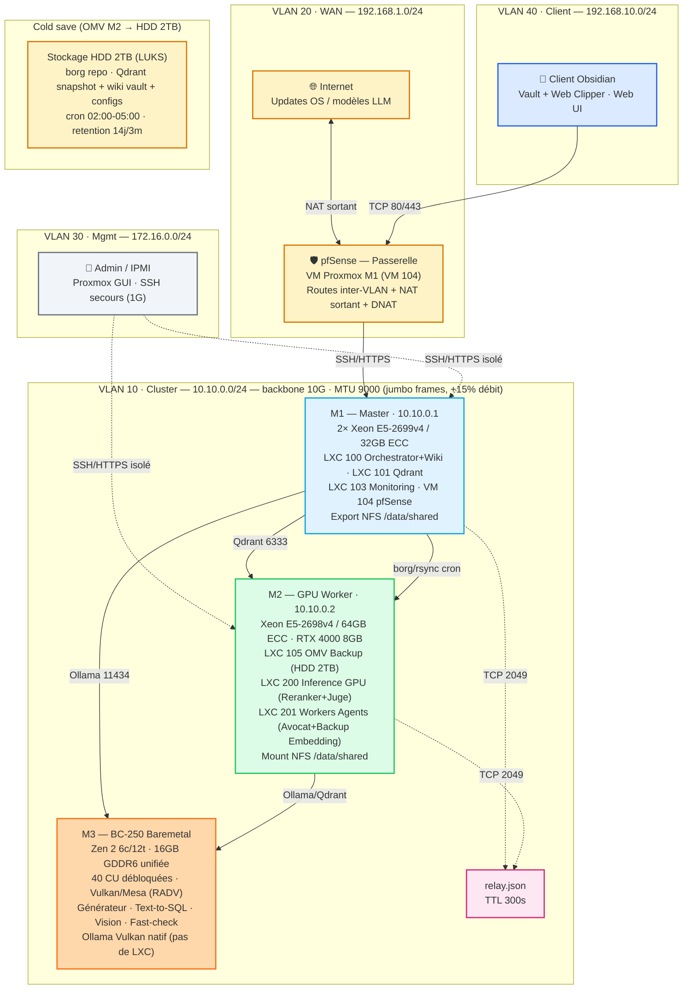

```mermaid
flowchart TB
    classDef wan fill:#fef3c7,stroke:#d97706,stroke-width:2px
    classDef client fill:#dbeafe,stroke:#2563eb,stroke-width:2px
    classDef mgmt fill:#f1f5f9,stroke:#6b7280,stroke-width:2px
    classDef m1 fill:#e0f2fe,stroke:#0ea5e9,stroke-width:2px
    classDef m2 fill:#dcfce7,stroke:#22c55e,stroke-width:2px
    classDef m3 fill:#fed7aa,stroke:#f97316,stroke-width:2px
    classDef relay fill:#fce7f3,stroke:#db2777,stroke-width:2px
    classDef cold fill:#fef3c7,stroke:#d97706,stroke-width:2px

    subgraph VLAN20["VLAN 20 · WAN — 192.168.1.0/24"]
        Internet["🌐 Internet<br/>Updates OS / modèles LLM"]:::wan
        pfSense["🛡️ pfSense — Passerelle<br/>VM Proxmox M1 (VM 104)<br/>Routes inter-VLAN + NAT sortant + DNAT"]:::wan
    end

    subgraph VLAN40["VLAN 40 · Client — 192.168.10.0/24"]
        Obsidian["🧠 Client Obsidian<br/>Vault + Web Clipper · Web UI"]:::client
    end

    subgraph VLAN30["VLAN 30 · Mgmt — 172.16.0.0/24"]
        Admin["🔧 Admin / IPMI<br/>Proxmox GUI · SSH secours (1G)"]:::mgmt
    end

    subgraph VLAN10["VLAN 10 · Cluster — 10.10.0.0/24 — backbone 10G · MTU 9000 (jumbo frames, +15% débit)"]
        M1["M1 — Master · 10.10.0.1<br/>2× Xeon E5-2699v4 / 32GB ECC<br/>LXC 100 Orchestrator+Wiki · LXC 101 Qdrant<br/>LXC 103 Monitoring · VM 104 pfSense<br/>Export NFS /data/shared"]:::m1
        M2["M2 — GPU Worker · 10.10.0.2<br/>Xeon E5-2698v4 / 64GB ECC · RTX 4000 8GB<br/>LXC 105 OMV Backup (HDD 2TB)<br/>LXC 200 Inference GPU (Reranker+Juge)<br/>LXC 201 Workers Agents (Avocat+Backup Embedding)<br/>Mount NFS /data/shared"]:::m2
        M3["M3 — BC-250 Baremetal<br/>Zen 2 6c/12t · 16GB GDDR6 unifiée<br/>40 CU débloquées · Vulkan/Mesa (RADV)<br/>Générateur · Text-to-SQL · Vision · Fast-check<br/>Ollama Vulkan natif (pas de LXC)"]:::m3
        Relay["relay.json<br/>TTL 300s"]:::relay
    end

    subgraph COLDBOX["Cold save (OMV M2 → HDD 2TB)"]
        HDD["Stockage HDD 2TB (LUKS)<br/>borg repo · Qdrant snapshot + wiki vault + configs<br/>cron 02:00-05:00 · retention 14j/3m"]:::cold
    end

    Internet <--> |NAT sortant| pfSense
    Obsidian -->|TCP 80/443| pfSense
    pfSense -->|SSH/HTTPS| M1
    Admin -.->|SSH/HTTPS isolé| M1
    Admin -.->|SSH/HTTPS isolé| M2
    M1 -->|Qdrant 6333| M2
    M1 -->|Ollama 11434| M3
    M2 -->|Ollama/Qdrant| M3
    M1 -.->|TCP 2049| Relay
    M2 -.->|TCP 2049| Relay
    M1 -->|borg/rsync cron| M2
```