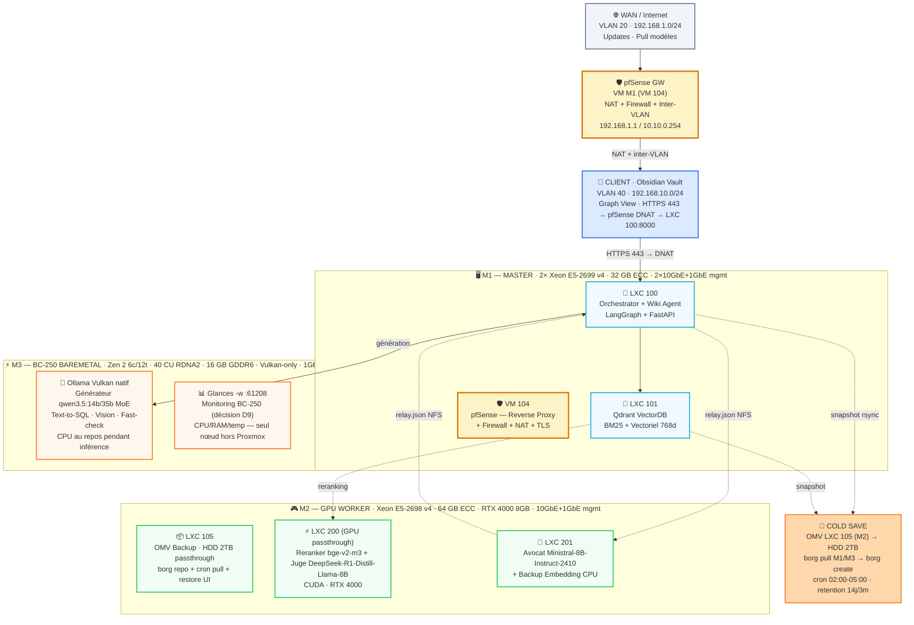

```mermaid
flowchart TB
    classDef wan fill:#f1f5f9,stroke:#64748b,stroke-width:2px
    classDef fw fill:#fef3c7,stroke:#d97706,stroke-width:3px
    classDef m1 fill:#f0f9ff,stroke:#0ea5e9,stroke-width:2px
    classDef m2 fill:#f0fdf4,stroke:#22c55e,stroke-width:2px
    classDef m3 fill:#fff7ed,stroke:#f97316,stroke-width:2px
    classDef client fill:#dbeafe,stroke:#2563eb,stroke-width:2px
    classDef cold fill:#fed7aa,stroke:#f97316,stroke-width:2px

    WAN["🌐 WAN / Internet<br/>VLAN 20 · 192.168.1.0/24<br/>Updates · Pull modèles"]:::wan
    GW["🛡️ pfSense GW<br/>VM M1 (VM 104)<br/>NAT + Firewall + Inter-VLAN<br/>192.168.1.1 / 10.10.0.254"]:::fw
    Client["🧠 CLIENT · Obsidian Vault<br/>VLAN 40 · 192.168.10.0/24<br/>Graph View · HTTPS 443 → pfSense DNAT → LXC 100:8000"]:::client

    subgraph M1["🖥️ M1 — MASTER · 2× Xeon E5-2699 v4 · 32 GB ECC · 2×10GbE+1GbE mgmt"]
        LXC100["🎯 LXC 100<br/>Orchestrator + Wiki Agent<br/>LangGraph + FastAPI"]:::m1
        LXC101["💾 LXC 101<br/>Qdrant VectorDB<br/>BM25 + Vectoriel 768d"]:::m1
        VM104["🛡️ VM 104<br/>pfSense — Reverse Proxy<br/>+ Firewall + NAT + TLS"]:::fw
    end

    subgraph M2["🎮 M2 — GPU WORKER · Xeon E5-2698 v4 · 64 GB ECC · RTX 4000 8GB · 10GbE+1GbE mgmt"]
        LXC105["📦 LXC 105<br/>OMV Backup · HDD 2TB passthrough<br/>borg repo + cron pull + restore UI"]:::m2
        LXC200["⚡ LXC 200 (GPU passthrough)<br/>Reranker bge-v2-m3 + Juge DeepSeek-R1-Distill-Llama-8B<br/>CUDA · RTX 4000"]:::m2
        LXC201["🤖 LXC 201<br/>Avocat Ministral-8B-Instruct-2410<br/>+ Backup Embedding CPU"]:::m2
    end

    subgraph M3["⚡ M3 — BC-250 BAREMETAL · Zen 2 6c/12t · 40 CU RDNA2 · 16 GB GDDR6 · Vulkan-only · 1GbE"]
        Ollama["🤖 Ollama Vulkan natif<br/>Générateur qwen3.5:14b/35b MoE<br/>Text-to-SQL · Vision · Fast-check<br/>CPU au repos pendant inférence"]:::m3
        Glances["📊 Glances -w :61208<br/>Monitoring BC-250 (décision D9)<br/>CPU/RAM/temp — seul nœud hors Proxmox"]:::m3
    end

    Cold["🧊 COLD SAVE<br/>OMV LXC 105 (M2) → HDD 2TB<br/>borg pull M1/M3 → borg create<br/>cron 02:00-05:00 · retention 14j/3m"]:::cold

    WAN --> GW
    GW -->|NAT + inter-VLAN| Client
    Client -->|HTTPS 443 → DNAT| LXC100
    LXC100 --> LXC101
    LXC100 -.->|relay.json NFS| LXC201
    LXC201 -.->|relay.json NFS| LXC100
    LXC100 -->|génération| Ollama
    LXC101 -.->|reranking| LXC200
    LXC100 -.->|snapshot rsync| Cold
    LXC101 -.->|snapshot| Cold
```